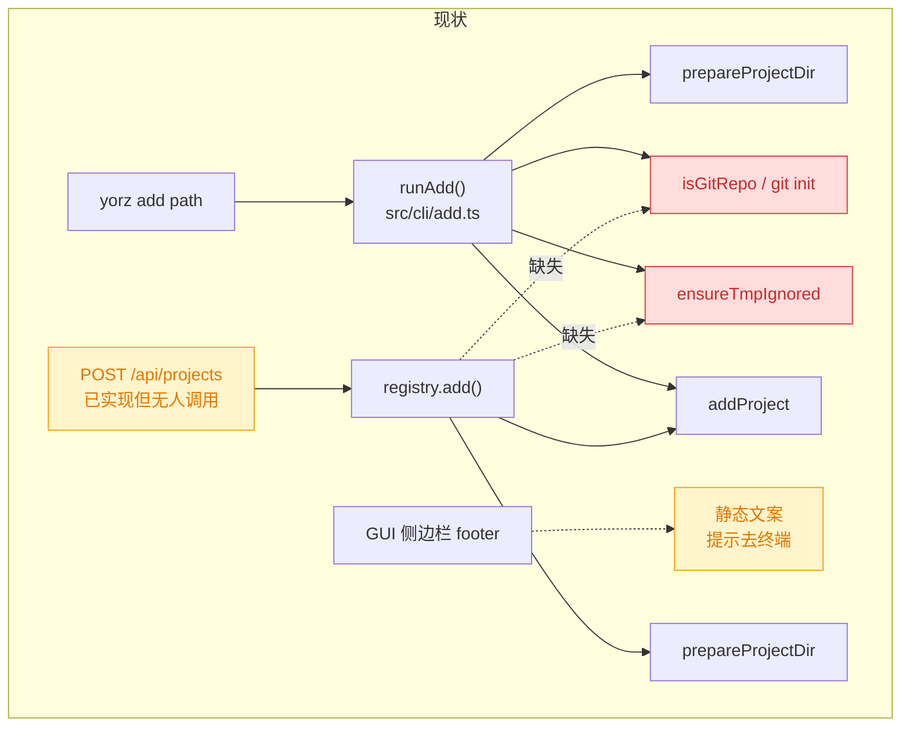
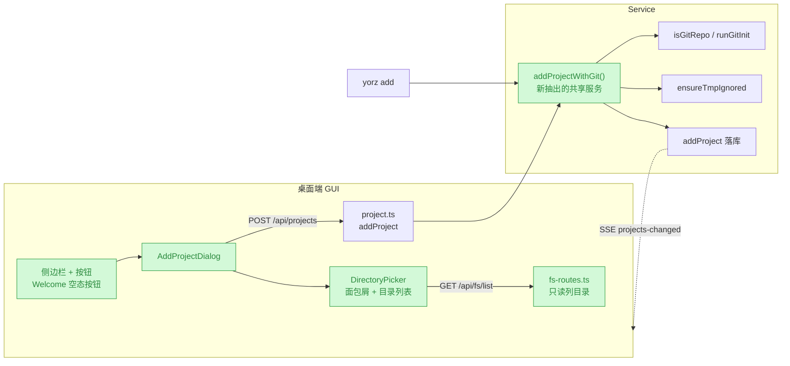
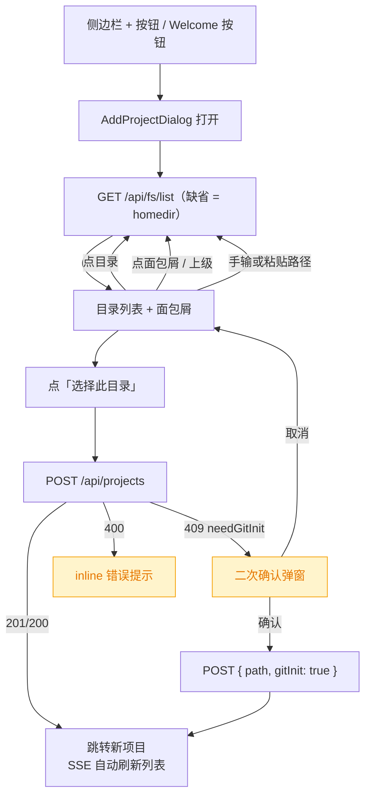

# GUI 添加项目与本地目录选择器

## 1. 背景

用户原始反馈：

> 当前添加项目，必须用户手动去终端执行 `yorz add <path>`；是否可以支持在 gui 页面添加项目路径？

现状是 GUI 只读展示项目列表，添加项目必须切到终端。侧边栏 footer 与空态页都只是静态提示用户去跑 CLI。

经确认，采用**方案 C：完整目录选择器**（而非纯手输绝对路径、或手输+补全），并要求**兼容 Windows**；移动端 PWA 本轮**不做**。

## 2. 需求

- 桌面端 GUI 可添加项目，不再强制用户使用终端。
- 通过一个简洁的本地目录选择器选择路径，而非让用户手输绝对路径。
- 目录选择器必须兼容 Windows（盘符、路径分隔符、权限受限目录、无控制台弹窗）。
- 添加行为须与 CLI `yorz add` 对齐：含 git 仓库检查 / `git init` / `.gitignore` 写入。
- 移动端 `src/gui-mobile/` 不提供添加入口（维持既有设计决策）。

## 3. 现状分析

结论先行：**后端添加项目的 HTTP 接口已存在且从未被前端调用**，但它与 CLI `yorz add` 存在行为落差；目录浏览能力则完全缺失。



### 3.1 前端：两处 CLI 引导，零处调用

桌面端项目列表是常驻左侧栏（非页面），数据源 `createResource(() => api.listProjects())`，并由 SSE `projects-changed` 驱动 `refetch`。两处引导用户去终端：

- `@src/gui/src/components/ProjectsSidebar.tsx:429` —— footer 静态文案 `t('sidebar.addHint')` + `t('sidebar.addCmd')`
- `@src/gui/src/pages/Welcome.tsx:13` —— 空态页同样提示 `yorz add <path>`

共享 API 层 `@src/gui-shared/api/index.ts:451` 仅有 `listProjects` / `removeProject` / `removeProjectWithFiles`，**没有任何 `POST /api/projects` 调用**。

### 3.2 后端：接口已就绪，但与 CLI 有行为落差

`@src/service/routes/project.ts:20` 的 `POST /projects` 已做完整入参校验（非空 / 绝对路径 / 存在 / 是目录），随后调用 `registry.add()`。而 `@src/service/project-registry.ts:129` 的 `add()` 只有三行——`prepareProjectDir` + `addProject`，相比 CLI 的 `runAdd` 少了两步：

| 步骤                               | CLI `yorz add` | `POST /api/projects` |
| ---------------------------------- | -------------- | -------------------- |
| `prepareProjectDir`（建目录）      | ✅             | ✅                   |
| git 仓库检查 + `git init`          | ✅ 交互确认    | ❌ **缺失**          |
| `ensureTmpIgnored`（写 gitignore） | ✅             | ❌ **缺失**          |
| `addProject`（落全局配置）         | ✅             | ✅                   |

直接经 HTTP 添加非 git 目录，项目会进列表但后续 git 面板 / worktree 功能不可用。

<details>
<summary>副作用顺序问题（影响错误处理设计）</summary>

`runAdd` 中 `prepareProjectDir` 跑在 git 校验**之前**，而它有副作用：`mkdir(join(abs, '.yorz', 'specs'), { recursive: true })`。因此「填了非 git 目录 → `.yorz/specs/` 已建好 → 才发现不是 git 仓库 → 报错中止」会留下脏目录。CLI 下一次性输入无伤大雅，GUI 下用户会反复试路径，每试错一次脏一个目录。

</details>

### 3.3 存储与事件：无数据库，改文件即广播

全局注册表是单个 JSON：`<globalConfigDir>/config.json`（`YORZ_HOME` > `$XDG_CONFIG_HOME/yorz` > `~/.config/yorz`），tmp+rename 原子写。`addProject` 按 `path` **字符串**去重，天然幂等（重复添加返回 `created: false` → HTTP 200）。

`@src/service/registry-events.ts` 的 `RegistryEventBus` watch 配置文件**父目录**（因原子写会让 per-file watcher 失效），200ms 防抖后 SSE 广播 `projects-changed`。故前端 POST 成功后列表会自动刷新，只需拿返回的 `id` 做跳转。

### 3.4 目录浏览能力：完全缺失

现有 `@src/service/routes/project-files.ts:207` 的 `GET /projects/:projectId/files` 是**项目内模糊搜索文件**（走 gitignore 过滤 + fuzzy 打分），语义与「浏览任意目录」不同，无法复用；仅其 `readdir` 失败静默跳过的容错写法可借鉴。全仓库没有任何「列举任意目录」的接口。

### 3.5 Windows 既有约定（必须遵守）

仓库已有成体系的 Windows 兼容积累，本需求必须落在既有约定内：

- `@src/service/process.ts` 提供 `withHiddenWindowsConsole` / `spawnWithoutWindow` / `execFileWithoutWindow`，**任何子进程都必须经它**，否则 Windows 弹空白 cmd（见 `260902.fix.windows-silent-cmd-popup`）。
- `@src/cli/git.ts:16` 的 `runGitInit` 已接入 `withHiddenWindowsConsole`，但用的是 `stdio: 'inherit'`——在 Service 进程内调用时无 TTY，需改为不依赖继承。
- `@docs/Windows-Compatibility-TODO.md` §5.2 已列出路径专项测试要求：盘符大小写、反斜杠/正斜杠、UNC 路径、长路径边界、路径含空格/中文/括号、文件名仅大小写变化。
- Windows 文件系统大小写不敏感（见 `260801.fix.windows-p0-runtime-safety` §3.2 的附件覆盖案例），而 `addProject` 按字符串去重 → `C:\Repo` 与 `c:\repo` 会被当成两个项目。

### 3.6 网络暴露面

`@src/service/index.ts:43` `DEFAULT_HOST = '127.0.0.1'`，且 `isLoopbackHost` 校验不通过直接抛错——Service **强制**只监听回环。移动端经 `tailscale serve --bg 7423` 反代访问（见 `260907.feat.mobile-pwa-access-docs`），处于用户私有 tailnet 内。

因此新增只读目录列举接口在**网络可达性**与**鉴权强度**两个维度与现有 API 完全同级，且返回的信息敏感度**低于**已有的 `GET /projects/:projectId/files`（后者可读文件内容）。

但在**可枚举广度**维度上确有扩大：现有接口的遍历根被锁在已注册项目目录内，新接口接受任意绝对路径。该取舍已列为待确认项 5.1。

## 4. 技术实现方案

整体分三层：新增只读目录浏览 API（后端）→ 对齐 CLI 的添加语义（后端）→ 目录选择器与添加入口（桌面端）。



### 4.1 后端：新增只读目录浏览 API

新建 `@src/service/routes/fs.ts`，导出 `createFsRoutes()`，在 `@src/service/server.ts` 中 `api.route('/', createFsRoutes())` 挂载。

> 决策说明：调研曾提示「`createEventsRoutes` 是 SSE catch-all，新路由必须排在它之前」。**经核实该结论不成立**——`@src/service/routes/events.ts` 只注册 `/events/stream` 与 `/events/subscribe` 两个具体路径，无 catch-all。故挂载顺序不受约束，按可读性追加即可。

单一端点：

```
GET /api/fs/list?path=<abs>&showHidden=<0|1>
```

响应：

```ts
interface FsListResult {
  path: string // 归一化后的当前目录绝对路径
  parent: string | null // 上级目录；已在根（或盘符根）时为 null
  sep: string // 平台分隔符，前端拼路径必须用它
  entries: { name: string; path: string }[] // 仅目录，已排序
  truncated: boolean // 是否因条目上限被截断
}
```

关键实现约束：

- **只返回目录，不返回文件**：`readdir(dir, { withFileTypes: true })` 后按 `isDirectory()` 过滤。对 symlink 用 `entry.isSymbolicLink()` 额外 `stat` 判定，失败则跳过（断链不应导致整体报错）。
- **不复用 `prepareProjectDir`**：后者有 `mkdir(.yorz/specs)` 副作用，浏览任意目录时绝不能触发。本路由只做 `isAbsolute` → `resolve` → `stat` 校验。
- **权限错误逐项跳过而非整体 500**：Windows 上 `C:\System Volume Information`、macOS 上 `~/Library` 子目录必然 `EPERM`/`EACCES`。沿用 `@src/service/routes/project-files.ts:163-168` 的 try/catch 静默跳过写法。
- **条目上限**：设 `MAX_ENTRIES = 1000`，超出截断并置 `truncated: true`，避免 `node_modules` 这类超大目录拖垮响应。不做 `stat` 取 mtime（`project-files.ts` 对每个文件 stat 的做法在目录浏览场景太慢）。
- **排序**：`localeCompare` 按名称升序；隐藏目录（`.` 开头）默认过滤，`showHidden=1` 时纳入。
- **缺省 path**：不传时返回 `homedir()`。

为可测性，签名注入平台依赖（与 `@src/service/process.ts:23`、`@src/service/system-notifications.ts:211` 的既有范式一致）：

```ts
export function createFsRoutes(
  deps: { homedir?: () => string; platform?: NodeJS.Platform } = {},
): Hono
```

### 4.2 Windows 专项处理

<details>
<summary>盘符枚举、路径归一化、UNC 与大小写的具体处理</summary>

**盘符枚举（根级列表）**

POSIX 下 `parent` 到 `/` 为止；Windows 下 `C:\` 的上级是「盘符列表」这一虚拟层级。约定：`path=""` 或 `path` 为特殊值时，win32 返回盘符作为 `entries`，`parent: null`。

实现取 **A–Z 逐个 `access()` 探测**，理由：

- 不派生子进程 → 天然不触发 `260902.fix.windows-silent-cmd-popup` 的空白 cmd 窗问题，无需 `withHiddenWindowsConsole`。
- `wmic logicaldisk` 已在 Win11 24H2 被移除，不可依赖；PowerShell `Get-PSDrive` 需起子进程且慢（数百 ms）。
- **跳过 `A:`/`B:`**：对空软驱/光驱做 `stat` 可能触发 Windows「请插入磁盘」模态框。只探测 `C:`–`Z:`。

**路径归一化（关键正确性点）**

`@src/service/global-config.ts:396` 的 `generateProjectId` 用 `sha256(absPath)` 且**直接吃原始字符串**，`slugify(basename())` 同理。这意味着 Windows 上 `C:\Repo`、`c:\repo`、`C:/Repo` 会生成**三个不同 id**，而 `addProject` 又按 `path` 字符串去重 → 同一目录被注册成多个项目。

处置：目录浏览 API 返回的 `path` 与 `POST /projects` 接收的 `path` 都必须经同一条 `resolve()` 归一化（`resolve` 在 win32 上会把 `/` 统一成 `\`）。**盘符大小写额外统一为大写**（`C:\...`），在 fs 路由与 `POST /projects` 入口各做一次，保证前端点选与手输殊途同归。

> 本 spec 只在**入口**做归一化，不改 `generateProjectId` 本身，也不迁移存量 registry 记录——那属于独立的数据迁移议题，不在本轮范围。

**UNC 路径**

`\\server\share` 形态：`isAbsolute` 判定为 true，`readdir` 可正常工作，但无「盘符根」概念。本轮**支持手输 UNC 并正常浏览**，但盘符枚举不主动发现网络位置（需要额外的网络枚举 API，收益低）。`parent` 回退到 `\\server\share` 即停。

**长路径**

Windows `MAX_PATH` 260 字符限制：仅在 API 层把 `ENAMETOOLONG`/`ENOENT` 转为可读错误提示，不做 `\\?\` 前缀改写（会影响 git 等下游行为，超出本轮范围）。

</details>

### 4.3 后端：对齐 CLI 的添加语义

把 `@src/cli/add.ts` 中 `runAdd` 的非交互部分抽成 service 层共享函数（放 `@src/service/project-registry.ts` 或新建 `@src/service/project-add.ts`），供 CLI 与 HTTP 复用，消除 3.2 的行为落差。

**调整执行顺序，修掉 3.2 的脏目录问题**：将 git 仓库检查提到 `prepareProjectDir` 之前，避免「建完 `.yorz/specs` 才发现不是 git 仓库」。

交互语义映射为两步式 HTTP：

1. `POST /api/projects { path }` → 若目标非 git 仓库，返回 `409 { error, needGitInit: true, path }`，**此时不产生任何副作用**。
2. 前端弹二次确认 → `POST /api/projects { path, gitInit: true }` → 执行 `git init` 后继续。

`runGitInit` 复用 `@src/cli/git.ts`，但需处理：它当前是 `stdio: 'inherit'`，Service 进程内无 TTY。改为可注入 stdio（Service 侧传 `'ignore'`），CLI 侧保持 `'inherit'` 不变——**不改变 macOS/Linux 既有 CLI 行为**，符合 `@docs/Windows-Compatibility-TODO.md` 的边界约定。`withHiddenWindowsConsole` 保持接入。

### 4.4 后端：修正 Windows 大小写重复注册

`addProject`（`@src/service/global-config.ts:418`）按 `path` 字符串精确去重。Windows 文件系统大小写不敏感，`C:\Repo` 与 `c:\repo` 指向同一目录却会被注册成两个项目。

处置：去重比较改为**平台感知**——win32 下大小写不敏感比较，POSIX 下维持现状。此做法与 `260801.fix.windows-p0-runtime-safety` §3.2 修附件 `uniquify()` 的思路一致（同样是把大小写敏感的 `Array.includes()` 改为平台感知），有先例可循。

> 决策说明：不改 `generateProjectId` 的 hash 输入，也不迁移存量 registry 记录。仅修去重比较 + 入口归一化，即可让「GUI 点选」与「CLI 手输」殊途同归，且对存量数据零影响。

### 4.5 前端：目录选择器与添加入口



**API client**（`@src/gui-shared/api/index.ts`，顶层路径直接写 `/api/...`，照 `listProjects` 写法）新增两个方法：

```ts
addProject: (path: string, opts?: { gitInit?: boolean }) => ...  // POST /api/projects
listDirs: (path?: string, showHidden?: boolean) => ...           // GET /api/fs/list
```

**组件**：新建 `@src/gui/src/components/AddProjectDialog.tsx`，照 `@src/gui/src/components/CommandMenu.tsx:145-198` 的表单弹窗骨架（`Dialog` + `Input` + inline `<p class="text-destructive">` 错误 + `DialogFooter` 双按钮 + `submitting` 禁用态）。目录选择器作为其内部区域实现，不单独抽组件——需求要求「简洁」，且当前无第二处复用点。

交互构成：面包屑（可点击逐级回退）＋「上级」按钮 ＋ 目录列表（单击进入）＋ 顶部可编辑路径输入框（支持粘贴，失焦/回车触发跳转）＋ 隐藏目录 toggle ＋ 底部「选择此目录」。Windows 根级展示盘符列表。

**逻辑下沉以保证可测**：桌面端**没有** Solid 组件渲染测试设施（`@vite.config.ts:82` 的 `test.include` 只匹配 `src/**/*.test.ts`，`environment: 'node'`，且未装 `@solidjs/testing-library`）。因此把纯逻辑抽到 `@src/gui/src/lib/dir-picker.ts` 单独单测，组件只留 JSX 与信号编排：

- `splitBreadcrumb(path, sep)` → 面包屑段（需处理 `C:\` 盘符根与 POSIX `/` 根的差异）
- `joinDir(parent, name, sep)` → 子目录路径拼接（**必须用后端返回的 `sep`，禁止硬编码 `/`**）
- `isAbsolutePathInput(raw)` → 手输校验，复用 `@src/gui-shared/lib/markdown.ts:151-154` 已有的 `/^[A-Za-z]:[\\/]/` 盘符正则思路（浏览器端无 `node:path` 可用）

**入口改造**：

- `@src/gui/src/components/ProjectsSidebar.tsx:429` —— footer 静态文案换成 `<Button>` + `Plus` 图标（`lucide-solid`）。折叠态 footer 目前是 `HelpCircle` 占位，一并换成图标按钮。
- `@src/gui/src/pages/Welcome.tsx` —— 空态页加主行动按钮。注意该文件第 13 行的 `yorz add <path>` 是**硬编码未走 i18n**，与 `sidebar.addCmd` 重复，本次一并清理。

**i18n**（`@src/gui/src/i18n/{zh-CN,en}.ts`）：废弃 `sidebar.addHint` / `sidebar.addCmd` / `welcome.addHint` 三条「请在终端执行」文案，新增 `addProject` 相关键组（标题 / 路径 / 上级 / 选择此目录 / 显示隐藏目录 / git 初始化确认 / 各类错误）。移动端 i18n **不动**。

### 4.6 测试策略

| 层           | 文件                                           | 方式                                                                                 |
| ------------ | ---------------------------------------------- | ------------------------------------------------------------------------------------ |
| 后端路由     | `src/service/__tests__/fs-routes.test.ts`      | 直接 `app.request()`（路径不带 `/api`），`mkdtemp` 造夹具，注入 `platform`/`homedir` |
| 后端添加语义 | `src/service/__tests__/project-add.test.ts`    | 覆盖 409 needGitInit、`gitInit: true` 后成功、gitignore 写入、大小写去重             |
| 前端纯逻辑   | `src/gui/src/lib/__tests__/dir-picker.test.ts` | 纯函数，含 win32 路径用例（`C:\`、反斜杠、UNC）                                      |
| E2E          | `src/gui/src/__e2e__/add-project.spec.ts`      | 中文文案定位；弹窗用 `page.locator('[role="dialog"]')`                               |

E2E 注意事项（来自既有 spec 的踩坑沉淀）：

- `@src/gui/src/components/ui/dialog.tsx:24` 的 `DialogContent` 取出 `rest` 后**从未展开**到 `DialogPrimitive.Content`，传入的 `data-testid` 会被静默丢弃。定位只能用 `[role="dialog"]` + 表单 `id` 选择器。
- `@playwright.config.ts` 设 `locale: 'zh-CN'`，断言必须用中文文案。
- 解析项目 id 用 `arr.find(p => p.name === '.tmp-e2e') ?? arr[0]`（见 `theme-switch.spec.ts:5-15`），不要用 `arr[0]`——本机注册多项目时未必是 e2e 临时项目。
- 用例需自行清理添加的项目，避免污染后续用例。

> 决策记录：「新增 `GET /api/fs/list`，可枚举范围从「项目内」扩大到「整机目录树」」—— 用户确认，按此推进，理由：接受在鉴权缺口补上前先行扩大只读可枚举面（Service 强制回环监听 + 私有 tailnet 反代已构成足够缓解）。

<details>
<summary>fs 路由响应类型与平台差异对照</summary>

```ts
interface FsListResult {
  path: string
  parent: string | null
  sep: string
  entries: { name: string; path: string }[]
  truncated: boolean
}
```

| 场景      | POSIX               | win32                                      |
| --------- | ------------------- | ------------------------------------------ |
| 缺省 path | `homedir()`         | `homedir()`                                |
| 根目录    | `/`，`parent: null` | 盘符列表层，`parent: null`                 |
| 盘符根    | —                   | `C:\`，`parent` 指向盘符列表层             |
| `sep`     | `/`                 | `\`                                        |
| 盘符枚举  | 不适用              | `C:`–`Z:` 逐个 `access()`，跳过 `A:`/`B:`  |
| UNC       | 不适用              | 支持手输浏览，`parent` 至 `\\server\share` |

</details>

## 5. 待确认项

_暂无_

## 6. 任务清单

- [x] 新建 `src/service/path-normalize.ts`，导出 `normalizeAbsPath(p, platform?)`（win32 盘符统一大写 + `resolve`）与 `samePath(a, b, platform?)`（win32 大小写不敏感）（验收：新增单测覆盖 `C:\Repo` / `c:/repo` 归一等价、POSIX 下大小写敏感）
- [x] 将 `isGitRepo` / `runGitInit` 从 `src/cli/git.ts` 迁至 `src/service/git-repo.ts`，`runGitInit` 增加可注入 `stdio`（默认 `'inherit'`），`src/cli/git.ts` 改为再导出（验收：`tsc -b` 通过，CLI 侧行为不变）
- [x] 将 `ensureTmpIgnored` / `hasIgnoreEntry` 从 `src/cli/install.ts` 迁至 `src/service/git-repo.ts`，`install.ts` 改为导入并再导出（验收：现有 install 相关测试全绿）
- [x] 新建 `src/service/project-add.ts` 导出 `addProjectWithGit()`：git 检查前置于 `prepareProjectDir`，非 git 且未授权时抛 `NeedGitInitError` 且零副作用；授权时 `runGitInit(stdio:'ignore')` → `prepareProjectDir` → `ensureTmpIgnored` → `addProject`（验收：`project-add.test.ts` 覆盖三条路径）
- [x] `src/cli/add.ts` 的 `runAdd` 改为复用 `addProjectWithGit`，保留 TTY 交互确认与 `--yes` 语义（验收：`src/cli/__tests__` 既有 add 测试全绿）
- [x] `src/service/global-config.ts` 的 `addProject` 去重比较改为平台感知（复用 `samePath`），并对入参做 `normalizeAbsPath`（验收：单测在注入 win32 时 `C:\Repo` 与 `c:\repo` 只注册一条）
- [x] 新建 `src/service/routes/fs.ts` 导出 `createFsRoutes({homedir?, platform?})`，实现 `GET /fs/list?path=&showHidden=`：仅列目录、逐项容错跳过、`MAX_ENTRIES=1000` 截断、`localeCompare` 排序、缺省 `homedir()`（验收：`fs-routes.test.ts` 通过）
- [x] 在 `src/service/routes/fs.ts` 实现 win32 分支：`path` 为空/虚拟根时用 `access()` 探测 `C:`–`Z:` 返回盘符列表（跳过 `A:`/`B:`）、`parent` 计算、UNC 到 `\\server\share` 即停、`ENAMETOOLONG`/`ENOENT` 转可读错误（验收：注入 `platform:'win32'` 的单测覆盖盘符根与 UNC）
- [x] `src/service/server.ts` 挂载 `api.route('/', createFsRoutes())`（验收：`GET /api/fs/list` 返回 200）
- [x] `src/service/routes/project.ts` 的 `POST /projects` 接入 `addProjectWithGit`：入口 `normalizeAbsPath`、支持 `gitInit: true`、非 git 未授权返回 `409 { error, needGitInit: true, path }`（验收：路由测试覆盖 409 → `gitInit:true` → 201）
- [x] 新建 `src/service/__tests__/fs-routes.test.ts`：`mkdtemp` 造夹具，覆盖缺省 homedir、隐藏目录 toggle、仅返回目录、截断、不存在路径 400、win32 注入用例（验收：`vitest run` 通过）
- [x] 新建 `src/service/__tests__/project-add.test.ts`：覆盖 409 needGitInit 零副作用（断言 `.yorz/specs` 未创建）、`gitInit:true` 成功、gitignore 写入、大小写去重（验收：`vitest run` 通过）
- [x] `src/gui-shared/api/index.ts` 新增 `listDirs(path?, showHidden?)` 与 `addProject(path, opts?)` 及 `FsListResult` 类型，`addProject` 需能把 409 的 `needGitInit` 透出给调用方（验收：`tsc -b` 通过）
- [x] 新建 `src/gui/src/lib/dir-picker.ts`：`splitBreadcrumb(path, sep)` / `joinDir(parent, name, sep)` / `isAbsolutePathInput(raw)`（验收：纯函数无 DOM 依赖）
- [x] 新建 `src/gui/src/lib/__tests__/dir-picker.test.ts`：含 POSIX 根、`C:\` 盘符根、反斜杠、UNC 用例（验收：`vitest run` 通过）
- [x] 新建 `src/gui/src/components/AddProjectDialog.tsx`：面包屑 + 上级 + 目录列表 + 可编辑路径输入 + 隐藏目录 toggle + 「选择此目录」+ git init 二次确认 + inline 错误（验收：`tsc -b` 通过）
- [x] 改造 `src/gui/src/components/ProjectsSidebar.tsx` footer：展开态与折叠态均换成 `Plus` 图标按钮并打开 `AddProjectDialog`（验收：无 `sidebar.addHint` / `sidebar.addCmd` 残留引用）
- [x] 改造 `src/gui/src/pages/Welcome.tsx`：移除硬编码 `yorz add <path>`，改为打开添加对话框的主行动按钮（验收：grep 无硬编码命令文案）
- [x] 更新 `src/gui/src/i18n/{zh-CN,en}.ts`：删除 `sidebar.addHint` / `sidebar.addCmd` / `welcome.addHint`，新增 `addProject.*` 键组（验收：两语言键集一致，无缺键）
- [x] 新建 `src/gui/src/__e2e__/add-project.spec.ts`：中文文案定位、`[role="dialog"]` 选择器、用例自清理（验收：`playwright test add-project` 通过）
- [x] 全量校验：`pnpm typecheck` + `pnpm test`（验收：均无失败）

## 7. 追加任务

- [fixed] [fix] 2026-09-14 18:03:59 | 添加目录 A 之后，url 已经切换到 A 项目，但左侧项目列表没有动态更新，刷新之后正确显示；
  - 描述：添加目录 A 之后，url 已经切换到 A 项目，但左侧项目列表没有动态更新，刷新之后正确显示；
删除 A 项目，再次添加 A 目录，项目列表能够动态更新
  - 结论：与本 spec 的添加链路无关。根因是 `SseMultiplex` 缺少连接看门狗——Service 重启后，浏览器经 vite/tailscale 等反向代理的 EventSource 停在 `readyState === OPEN` 却永不再有数据（僵尸连接），此后所有 SSE 实时更新静默失效，刷新页面才恢复。修复见 `debug.md` Debug 1。

## 8. 执行记录

- 路径归一化：新建 `src/service/path-normalize.ts`（`normalizeAbsPath` / `samePath`）+ `__tests__/path-normalize.test.ts`（8 例）。验证：`vitest run` 通过。
- git 能力下沉：新建 `src/service/git-repo.ts`，收拢 `isGitRepo` / `runGitInit`（新增可注入 `stdio`）/ `ensureTmpIgnored` / `hasIgnoreEntry`；`src/cli/git.ts` 改为再导出，`src/cli/install.ts` 改为导入并再导出。验证：`tsc -b` 通过，`src/cli/__tests__` 91 例全绿，CLI 侧仍走 `stdio: 'inherit'`。
- 共享添加语义：新建 `src/service/project-add.ts`（`addProjectWithGit` + `NeedGitInitError`），git 检查前置于 `prepareProjectDir`，非 git 且未授权时零副作用抛错。`src/cli/add.ts` 的 `runAdd` 改为在其上补 TTY 交互与 `--yes`。
- 去重修正：`src/service/global-config.ts` 的 `addProject` 增加 `platform` 参数，去重比较改用 `samePath`（win32 大小写不敏感）。
- 目录浏览 API：新建 `src/service/routes/fs.ts`（`GET /fs/list`），仅列目录、symlink 二次 `stat`、逐项容错、`MAX_ENTRIES=1000` 截断、`localeCompare` 排序、缺省 `homedir()`；win32 分支实现 `C:`–`Z:` 的 `access()` 盘符探测（跳过 `A:`/`B:`，不派生子进程）、`resolveParent` 覆盖盘符根/UNC、fs 错误码转可读提示。`src/service/server.ts` 已挂载。
- 两步式 HTTP：`src/service/routes/project.ts` 的 `POST /projects` 入口做 `normalizeAbsPath`，改调 `registry.addWithGit()`，非 git 未授权返回 `409 { needGitInit: true, path }`。`ProjectRegistry` 新增 `addWithGit()`。
- 后端测试：`fs-routes.test.ts`（12 例）、`project-add.test.ts`（11 例，含路由层 409 → `gitInit:true` → 201 与 `.yorz` 零副作用断言）。
- 前端：`gui-shared/api` 新增 `listDirs` / `addProject`（409 转 `{ ok: false, needGitInit }` 而非抛错）与 `FsListResult` 类型；新建 `src/gui/src/lib/dir-picker.ts`（3 个纯函数）+ 11 例单测；新建 `AddProjectDialog.tsx`；`ProjectsSidebar.tsx` 展开/折叠态 footer 均换成 `Plus` 按钮；`Welcome.tsx` 换成主行动按钮并移除硬编码 `yorz add <path>`；i18n 删 3 条旧键、加 `addProject.*` 键组（中英对齐）。
- 回归适配：`spec-drafts-route.test.ts` 中「另一个项目」用例原先 POST 非 git 临时目录，按新语义会得到 409；已预置 `.git` 走直通路径（属本 spec 有意引入的行为变更，非新需求）。
- 全量验证：`tsc -b` 通过；`vitest run` 94 文件 / 952 通过 2 跳过；`pnpm run build` 成功；`playwright test add-project` 2 例通过（含真实 `git init` 在 Service 进程内以 `stdio: 'ignore'` 执行）。
- 收尾：任务清单全部完成，待确认项为空，`stage` 置 `done`。
- 追加 fix（Debug 1）：排查证明添加链路本身无缺陷（后端广播、前端 refetch、DOM 更新全部正常）；真实根因是 `src/gui-shared/api/sse.ts` 的 `SseMultiplex` 没有连接活性检测，Service 重启后经代理的 EventSource 变成「OPEN 但永不再有数据」的僵尸连接。已补心跳看门狗（16s 静默或 CLOSED 即重建 + 重订阅全部 topic）与 4 例单测 `src/gui-shared/api/__tests__/sse-watchdog.test.ts`。详见 `debug.md`。
