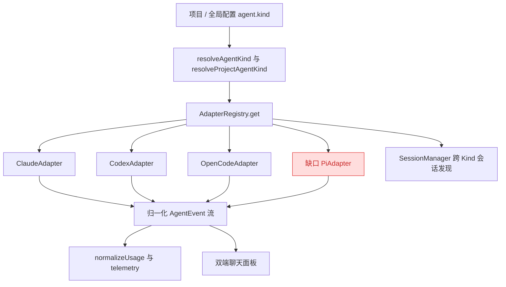
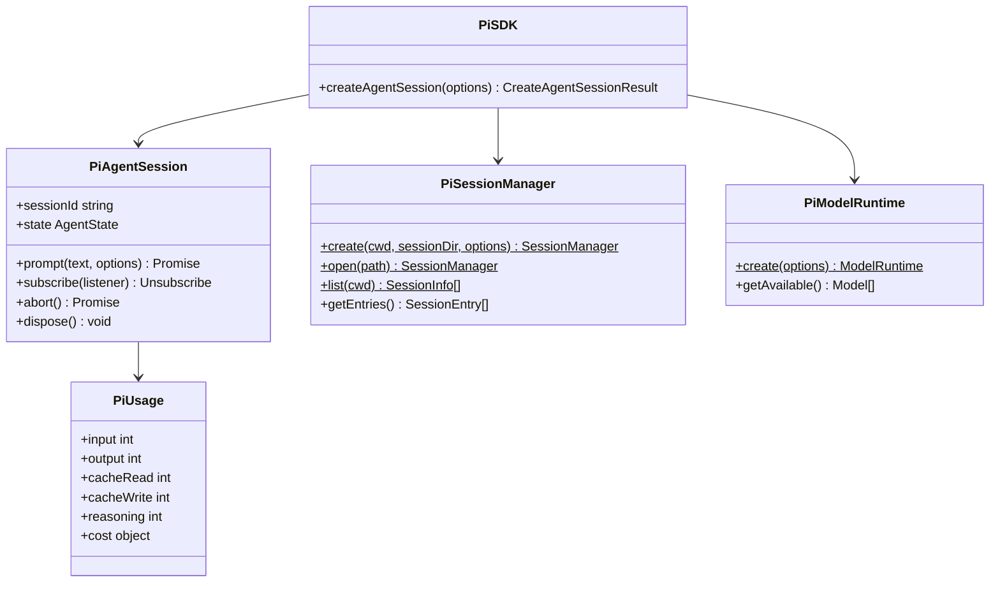
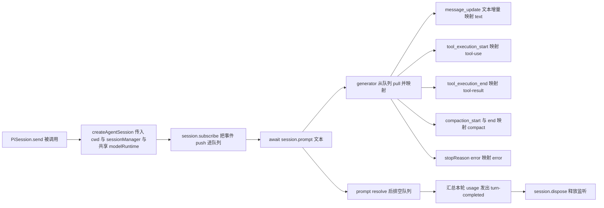
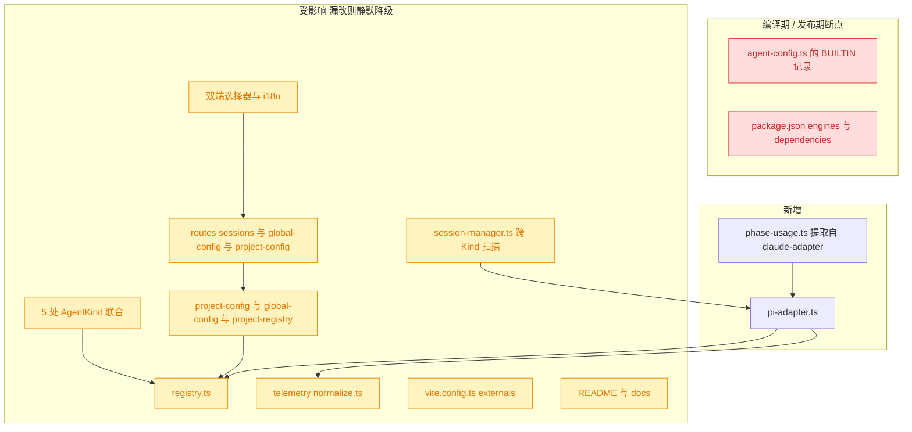

# 接入 Pi Agent SDK

## 1. 背景

YorZ 目前通过 `AgentSdkAdapter` 统一接口支持三种 Agent 后端：Claude Code、Codex、OpenCode。用户希望再接入 Pi Agent（官方文档 <https://pi.dev/docs/latest/sdk>，npm 包 `@earendil-works/pi-coding-agent`），让 Pi 与既有三种后端一样可以在全局配置 / 项目配置中被选中，并复用 YorZ 的 spec 驱动工作流、会话列表、聊天记录与用量统计。

参考实现：`@src/service/agent-sdk/claude-adapter.ts`（进程内 SDK + 流式迭代 + 阶段用量拆分）、`@src/service/agent-sdk/codex-adapter.ts`（本地 JSONL 会话存储解析 + 用量查询）、`@src/service/agent-sdk/opencode-adapter.ts`（第三方 SDK + 懒启动 + 诚实的 capabilities 声明）。

## 2. 需求

1. 新增 `pi` 这一种 Agent Kind，可通过全局配置默认值与项目配置选中，桌面端与移动端设置界面均可选择。
2. 新增 `PiAdapter`，实现 `AgentSdkAdapter` 全部契约：新建会话、恢复会话、流式对话、列举原生会话、读取历史消息、能力声明。
3. 对话事件映射到 YorZ 归一化事件（文本增量、工具调用、工具结果、压缩、错误、回合结束），保证聊天面板与既有三种后端观感一致。
4. 用量接入 telemetry 归一化链路，让 Pi 的 token / 成本进入既有统计与 plan/execute 阶段拆分。
5. 打通全部接线面：类型联合、适配器注册表、配置读写与校验、服务端路由白名单、跨后端会话发现、i18n 与文档。

## 3. 现状分析

YorZ 的 Agent 抽象已经很干净：所有后端差异都收敛在 `src/service/agent-sdk/*-adapter.ts` 内，上层（会话管理、路由、双端 UI）只认 `AgentKind` 字符串与归一化事件。因此接入 Pi 的工作量分成两块——**一个新适配器文件**，以及**散落在 20+ 处的 Kind 接线**。后者才是容易遗漏的部分：多处使用硬编码字面量白名单（而非从联合类型推导），漏改不会报编译错误，只会静默降级回 `claude`。

现有接线面精确定位（硬编码白名单 = 漏改即静默降级）

类型联合（5 处独立声明，均需扩张）：

- `@src/service/agent-sdk/types.ts:3` —— 规范源 `export type AgentKind = 'claude' | 'codex' | 'opencode'`。
- `@src/service/agent-config.ts:4` `AgentName`、`:39` `AgentKind` —— CLI spawn 路径的两个重复联合。
- `@src/service/global-config.ts:49` `GlobalAgentKind`。
- `@src/service/project-config.ts:7-11` `AgentConfig` 判别联合。
- `@src/gui-shared/api/index.ts:135-139 / :189 / :225` —— 前端镜像类型。

硬编码白名单 / 分支（漏改静默降级为 claude）：

- `@src/service/agent-config.ts:66,70` `resolveAgentKind` 只认 `codex | opencode`。
- `@src/service/agent-config.ts:73-124` `BUILTIN: Record<AgentName, AgentCmd>` —— 一旦 `AgentName` 加 `'pi'`，缺少 `pi:` 条目会**编译失败**（本仓唯一有编译保护的点）。
- `@src/service/agent-config.ts:165-173` `readAgentCmd` 两个分支。
- `@src/service/project-config.ts:132-147` `normalizeAgent`（legacy 字符串 + 对象两条路径）。
- `@src/service/global-config.ts:231` `normalizeAgent` 的 `defaultKind` 白名单。
- `@src/service/project-registry.ts:253-259` `resolveProjectAgentKind:258` 白名单。
- `@src/service/routes/sessions.ts:34` `const KINDS: AgentKind[] = ['claude','codex','opencode']`。
- `@src/service/routes/global-config.ts:96-97`、`@src/service/routes/project-config.ts:128-132` 入参校验与报错文案。
- `@src/service/session-manager.ts:221` `for (const kind of ['claude','codex','opencode'] as AgentKind[])` —— 跨 Kind 原生会话发现扫描。
- `@src/service/telemetry/normalize.ts:12-22` —— 三元链，未命中的 kind **静默走 `fromClaude` 的 snake_case 解析**，结果全为 `undefined`。
- `@src/skill/yorz-spec/__tests__/runner.ts:60-64` `resolveTestAgent` 白名单。
- `@vite.config.ts:30-32` CLI 打包 externals 列表。

双端 UI 与文案：

- 桌面 `@src/gui/src/components/GlobalConfigDialog.tsx:39,153-156,229`、`@src/gui/src/components/ProjectConfigDialog.tsx:25,64-68,119`（走 i18n key）。
- 移动 `@src/gui-mobile/src/pages/settings/GlobalSettings.tsx:36-40`、`@src/gui-mobile/src/pages/settings/ProjectSettings.tsx:25,29-34`（现状为硬编码 label）。
- i18n `@src/gui/src/i18n/zh-CN.ts:358-360`、`@src/gui/src/i18n/en.ts:363-365`（`agentClaude/agentOpencode/agentCodex`）。
- 全仓无按 Kind 区分的图标 / 配色，只有文本 label。

Pi SDK 与既有三家的能力对位如下。它是**进程内 SDK**（最接近 Claude Agent SDK），但事件模型是 `subscribe` 回调而非异步迭代器；会话为本地 JSONL 树结构（最接近 Codex）；没有审批门（工具直接执行），也没有配额查询接口（同 OpenCode）。

Pi SDK 关键类型与约束原文（取自 0.85.1 的 d.ts / docs）

- 包名 `@earendil-works/pi-coding-agent@0.85.1`，MIT，解包体积约 21.9 MB（内含 TUI 与 wasm 图像库），`engines.node = ">=22.19.0"`；另有 `legacy-node20` dist-tag 停留在 0.74.2。对照：YorZ `package.json` 声明 `engines.node = ">=20"`，现有三家 SDK 均声明 `>=18`。
- 入口：`createAgentSession(options?: CreateAgentSessionOptions): Promise<{ session, extensionsResult, modelFallbackMessage? }>`；`options` 含 `cwd` / `agentDir` / `modelRuntime` / `model` / `thinkingLevel` / `tools` / `excludeTools` / `customTools` / `sessionManager` / `settingsManager`。
- `AgentSession`：`prompt(text, options?): Promise<void>`（await 到本回合结束）、`subscribe(listener): () => void`、`abort(): Promise<void>`、`dispose(): void`、`waitForIdle()`、`compact()`、只读 `sessionId` / `sessionFile` / `state` / `model` / `isStreaming` / `isIdle`。
- 核心事件（`@earendil-works/pi-agent-core` 的 `AgentEvent`）：
  `agent_start` / `agent_end{messages}` / `turn_start` / `turn_end{message,toolResults}` / `message_start{message}` / `message_update{message,assistantMessageEvent}` / `message_end{message}` / `tool_execution_start{toolCallId,toolName,args}` / `tool_execution_update{...,partialResult}` / `tool_execution_end{toolCallId,toolName,result,isError}`。
- 会话层扩展事件（`AgentSessionEvent`）：`agent_settled`、`queue_update`、`entry_appended{entry}`、`session_info_changed`、`thinking_level_changed`、`compaction_start{reason}`、`compaction_end{reason,result,aborted,willRetry,errorMessage?}`、`auto_retry_start/end`、`summarization_retry_*`、`bash_execution_update`。
- 消息结构（`@earendil-works/pi-ai`）：
  `UserMessage{role:'user', content: string | (TextContent|ImageContent)[], timestamp}`；
  `AssistantMessage{role:'assistant', content:(TextContent|ThinkingContent|ToolCall)[], model, usage: Usage, stopReason, errorMessage?, timestamp}`；
  `ToolResultMessage{role:'toolResult', toolCallId, toolName, content:(TextContent|ImageContent)[], isError, timestamp}`。
- `Usage{input, output, cacheRead, cacheWrite, cacheWrite1h?, reasoning?, totalTokens, cost:{input,output,cacheRead,cacheWrite,total}}`；`reasoning` 是 `output` 的子集，`cacheWrite1h` 是 `cacheWrite` 的子集。
- 会话文件：`~/.pi/agent/sessions/--<编码后的 cwd>--/<timestamp>_<session-id>.jsonl`；首行 `SessionHeader{type:'session',version:3,id,timestamp,cwd}`，后续 entry 以 `id`/`parentId` 构成可分支的树；entry 类型含 `message` / `compaction{summary,firstKeptEntryId,tokensBefore,usage?}` / `model_change` / `session_info{name}` 等。
- `SessionManager.list(cwd): Promise<SessionInfo[]>`，`SessionInfo{path,id,cwd,name?,parentSessionPath?,created:Date,modified:Date,messageCount,firstMessage,allMessagesText}`。
- 权限：SDK 层**没有**工具审批 / 拦截 API（`grep -rn "approval|permission" dist/core/*.d.ts` 只命中扩展 UI 的 `confirm` 对话框）；内置工具 `read/bash/powershell/edit/write/grep/find/ls` 在 agent 决定后直接执行，等价于 Claude 的 `bypassPermissions`。项目信任（`resolveProjectTrusted`）只在 CLI 的 interactive/print/json/rpc 模式调用，`createAgentSession` 不走该门。
- 读文件不限制在 cwd 内：`dist/harness/tools/path-utils.js` 的 `resolveReadToolPath` 只做路径规整，无沙箱边界——YorZ 安装在 `~/.config/yorz/skills/` 的 skill 能被正常读取。
- 认证与模型：`ModelRuntime.create()` 读取 `~/.pi/agent/auth.json` + `models.json`，模型自带 BYO provider；**没有**类似 Claude `rate_limits` / Codex `usage` 的配额接口。
- CLI：`pi -p "<prompt>"` 为非交互模式，`--mode json` 输出 JSON Lines，`--tools` / `--exclude-tools` 控制工具集；无需权限旁路参数。

## 4. 技术实现方案

### 4.1 总体设计

新增 `@src/service/agent-sdk/pi-adapter.ts`，在其中完成 Pi SDK 到 YorZ 契约的全部翻译，其余改动都是纯接线（把 `'pi'` 加进联合类型与白名单）。适配器内部有三个需要设计的点：

1. **回调 → 异步迭代**：Pi 用 `session.subscribe(listener)` 推事件，而 `AgentSession.send()` 必须返回 `AsyncIterable<AgentEvent>`。用一个「事件队列 + waiter promise」桥接：listener 只负责 push + 唤醒，`send()` 的 generator 负责 pull 与映射，`await session.prompt()` 结束后关闭队列并把残余事件排空。
2. **会话生命周期**：`createAgentSession()` 每次都要加载扩展 / skills / 模型目录，成本不低；但 YorZ 的 `AgentSession` 契约没有 `dispose()`，常驻实例无处释放。折中为 **每个 `send()` 建一次 Pi 会话、回合结束即 `dispose()`**，同时在 Adapter 级缓存共享一个 `ModelRuntime`（网络 / 目录刷新的大头），把重复成本压到最低。这也让语义与 Claude 适配器一致（每次 `send` 一个 `query()`）。
3. **会话 id ↔ 文件路径**：Pi 的恢复入口是 `SessionManager.open(path)` 而非 id，因此 Adapter 维护 `id → path` 的惰性索引，由 `SessionManager.list(cwd)` 构建并在 miss 时刷新。

### 4.2 PiAdapter 与 PiSession 职责

- `PiAdapter implements AgentSdkAdapter`，`kind = 'pi'`，构造入参 `cwd`（与另外三家一致），另可注入 `agentDir` 便于测试。
- 懒启动 + promise 记忆化的 `ensureRuntime()`：仿 `OpenCodeAdapter.ensure()` 的写法（失败时把缓存置空以便重试），只是这里托管的是 `ModelRuntime` 而不是子进程。
- `createSession()`：不立即建 Pi 会话，只生成一个 UUID 作为会话 id，首个 `send()` 时以 `SessionManager.create(cwd, undefined, { id })` 落盘，`session-started` 事件照 Claude 适配器的方式发出。
- `resumeSession(id)`：只记录 id，`send()` 时通过 `id → path` 索引 `SessionManager.open(path)` 恢复；路径找不到时降级为新建并在事件流里给出 `error`。
- `dispose()`：释放共享 `ModelRuntime` 引用（无子进程可关），由 `AdapterRegistry.dispose()` 触发。

### 4.3 事件映射表

| Pi 事件                               | 条件                                          | YorZ `AgentEvent`                                                                           |
| ------------------------------------- | --------------------------------------------- | ------------------------------------------------------------------------------------------- |
| `message_update`                      | `assistantMessageEvent.type === 'text_delta'` | `{ type: 'text', delta }`                                                                   |
| `message_update`                      | `thinking_delta`                              | 丢弃（与 Codex 的 reasoning 处理一致）                                                      |
| `tool_execution_start`                | ——                                            | `{ type: 'tool-use', name: toolName, input: args }`                                         |
| `tool_execution_end`                  | ——                                            | `{ type: 'tool-result', text: 文本化 result }`                                              |
| `message_end`                         | assistant 消息                                | 累加 `usage` 到阶段累加器                                                                   |
| `compaction_start` / `compaction_end` | ——                                            | `{ type: 'compact', metrics }`，`trigger` 由 `reason === 'manual' ? 'manual' : 'auto'` 推导 |
| `agent_end` / prompt resolve          | `stopReason === 'error'`                      | `{ type: 'error', message: errorMessage }`                                                  |
| prompt resolve                        | 正常结束                                      | `{ type: 'turn-completed', usage, metrics }`                                                |
| `abort()` 后                          | ——                                            | 直接结束迭代，不发 `error`（与 Claude / Codex 一致）                                        |

因为每条 assistant 消息都自带 `usage`，Claude 适配器里的 `PhaseAccumulator`（plan → execute 阶段用量拆分、`isSpecWrite` 探测 spec 写回）可以原样复用。计划把 `PhaseAccumulator` 与 `isSpecWrite` 从 `claude-adapter.ts` 提取到 `@src/service/agent-sdk/phase-usage.ts` 共用，避免第二份拷贝——提取时 `PhaseAccumulator` 需要接受 `kind` 参数以调用对应的 `normalizeUsage`。

### 4.4 会话列举与历史读取

- `listSessions()`：`SessionManager.list(this.cwd)` 天然按 cwd 编码目录分桶；再按 `info.cwd === this.cwd`（老会话该字段为空串，放行）二次过滤。`title` 取 `name ?? firstMessage 截断 ?? id`，截断逻辑复用 `summarizeCodexPromptForTitle` 的思路（导出为共享函数或在 pi 适配器内保留一份轻量版）。`createdAt/updatedAt` 由 `created/modified` 的 `Date` 转 epoch。
- `getMessages(id)`：`SessionManager.open(path)` 后取 `getEntries()`，只处理 `type === 'message'` 的 entry，按 role 映射到 `NormalizedMessage`：`user` 取文本内容；`assistant` 把 `TextContent` → `text` part、`ToolCall` → `tool-use` part、丢弃 `ThinkingContent`；`toolResult` 归到 `assistant` 消息的 `tool-result` part（与 Claude 适配器把 tool_result 放进 user 消息的做法不同——Pi 的 toolResult 是独立 role，映射到最近一条 assistant 更贴近 UI 语义）。`ts` 取消息自带的毫秒 `timestamp`。

### 4.5 用量归一化与能力声明

`@src/service/telemetry/normalize.ts` 增加 `fromPi`：`input → inputTokens`、`output → outputTokens`、`cacheRead → cacheReadTokens`、`cacheWrite → cacheCreateTokens`、`reasoning → reasoningTokens`、`cost.total → costUsd`。不处理 `cacheWrite1h`（它是 `cacheWrite` 的子集，另计会双算）；`reasoning` 是 `output` 的子集，与 `fromOpenCode` 的既有语义一致，直接映射。

`capabilities()` 返回 `{ listSessions: true, getMessages: true, usageStatus: false }`——Pi 是 BYO provider，`ModelRuntime` 只有认证状态、没有配额窗口，照 `OpenCodeAdapter` 的先例明确声明不支持，前端据此不渲染任何内容，好过留一个必然失败的探测。

### 4.6 接线改动清单

按 3.1 折叠块中定位的点逐一扩张：5 处类型联合加 `'pi'`；`BUILTIN` 增加 `pi: { cmd: 'pi', args: (prompt) => ['-p', prompt], streamFormat: 'text' }`（Pi 无需权限旁路参数，cwd 由 spawn 传入即可，无需 `env` 覆盖）；`registry.ts` 增加 `case 'pi'`；配置归一化 / 路由校验 / 会话发现 / 测试 runner 的白名单同步；`vite.config.ts` externals 加入该包；桌面端新增 i18n key `agentPi` 并加入两个选择器，移动端按其现状追加 `{ value: 'pi', label: 'Pi' }`；README / README_CN / User-Guide(-CN) / Architecture 的 Agent 列表补充 Pi。

### 4.7 决策说明

> 决策记录：待确认项「Pi SDK 的依赖引入方式与 Node 版本门槛如何取舍」—— 用户选择「常规 `dependencies` + 静态 `import`，同时把 `engines.node` 提升到 `>=22.19.0`」，理由：写法与另外三家完全一致、类型最直接；接受 Node 20/21 用户升级 `@yorz/cli` 后无法安装的代价。

- **依赖引入方式：常规 `dependencies` + 静态 `import`**：`@earendil-works/pi-coding-agent@0.85.1` 进 `dependencies`，`pi-adapter.ts` 顶部静态 `import` / `import type`，与 claude / codex / opencode 三家写法完全一致；同步把 `package.json` 的 `engines.node` 从 `>=20` 提升到 `>=22.19.0`，并在 README / User-Guide 注明该门槛。被否决的备选：动态 `import()` 懒加载（多一层间接、类型需拆分）、`optionalDependencies`（半装状态难诊断、lockfile 漂移）。
- **每回合新建 Pi 会话，而非常驻**：`AgentSession` 契约无释放钩子，常驻实例会随会话数线性泄漏监听器与扩展运行时；共享 `ModelRuntime` 已覆盖主要开销。被否决的备选：Adapter 内维护 `Map<id, PiAgentSession>` 常驻池（需要额外的 LRU 与超时回收，复杂度不划算）。
- **不传 `tools` 白名单**：`CreateAgentSessionOptions.tools` 一旦给出就变成**全量白名单**，会连带禁用用户自己的扩展 / 自定义工具。因此保持默认（尊重用户 `defaultTools` 设置与扩展），bash 已能覆盖检索需求。
- **不做 YorZ 侧模型选择**：与另外三家一致，模型 / 认证交给 Pi 自己的配置（`pi` CLI 登录写入 `~/.pi/agent/auth.json`）。`createAgentSession` 在未配置时会抛错，适配器把错误原样转成 `{ type: 'error' }` 并在文档中写明先跑一次 `pi` 完成登录。
- **不实现 `getUsageStatus`**：见 4.5。
- **移动端沿用硬编码 label**：AGENTS.md 要求用户可见文案走 i18n，但移动端 `AGENT_KINDS` 现状即为硬编码（`'Claude'` / `'Codex'` / `'opencode'`）。本次只追加一项保持一致，不顺带重构该列表（属独立的 i18n 整改，不在本 spec 范围）。
- **`isSpecWrite` 的工具名**：Pi 的写文件工具名为 `write` / `edit`（小写），与 Claude 的 `Write` / `Edit` 不同，提取共享模块时要按 kind 提供各自的工具名集合。

### 4.8 兼容性与影响范围

本次是纯增量扩展，既有三种后端的行为不变。唯一的硬风险在**发布期门槛**：按 4.7 的决策，`engines.node` 由 `>=20` 提升到 `>=22.19.0`，Node 20/21 用户升级 `@yorz/cli` 后将无法安装（npm 对根包 engines 不匹配默认报错），需在 README / User-Guide 的安装说明中显式告知。另有一处编译期断点：`AgentName` 扩张后 `BUILTIN: Record<AgentName, AgentCmd>` 必须同步补 `pi` 条目，否则 `tsc -b` 直接失败（这也是唯一有编译保护的接线点，其余漏改只会静默降级为 `claude`）。

## 5. 待确认项

_暂无_

## 6. 任务清单

- [x] 安装依赖并抬高 Node 门槛：`package.json` 加入 `@earendil-works/pi-coding-agent@^0.85.1` 到 `dependencies`，`engines.node` 改为 `>=22.19.0`，`vite.config.ts:30-32` externals 追加该包（验收：`pnpm install` 成功、`node_modules/@earendil-works/pi-coding-agent` 存在、`pnpm build:cli` 通过）
- [x] 提取阶段用量共享模块 `src/service/agent-sdk/phase-usage.ts`：从 `claude-adapter.ts` 迁出 `PhaseAccumulator` 与 `isSpecWrite`，`PhaseAccumulator` 接受 `kind` 参数以调用对应 `normalizeUsage`，`isSpecWrite` 按 kind 取写文件工具名集合（claude: `Write`/`Edit`；pi: `write`/`edit`），`claude-adapter.ts` 改为引用（验收：`pnpm typecheck` 通过、`pnpm test` 中既有 telemetry / adapter 用例全绿）
- [x] 扩张 5 处 `AgentKind` 联合加入 `'pi'`：`src/service/agent-sdk/types.ts:3`、`src/service/agent-config.ts:4`+`:39`、`src/service/global-config.ts:49`、`src/service/project-config.ts:7-11`、`src/gui-shared/api/index.ts:135-139`+`:189`+`:225`（验收：`pnpm typecheck` 仅在 `BUILTIN: Record<AgentName, AgentCmd>` 处报缺 `pi` 键）
- [x] 实现 `src/service/agent-sdk/pi-adapter.ts`：`PiAdapter implements AgentSdkAdapter`（`kind='pi'`，构造入参 `cwd`，可选 `agentDir`），懒启动记忆化 `ensureRuntime()` 共享 `ModelRuntime`，`createSession()` 生成 UUID 且首个 `send()` 落盘、`resumeSession(id)` 经 `id → path` 惰性索引 `SessionManager.open`，`send()` 用「事件队列 + waiter promise」把 `session.subscribe` 桥接为 `AsyncIterable`，回合结束 `dispose()`（验收：`pnpm typecheck` 通过）
- [x] 在 `pi-adapter.ts` 内实现 4.3 事件映射表：`message_update(text_delta)→text`、丢弃 `thinking_delta`、`tool_execution_start→tool-use`、`tool_execution_end→tool-result`、`compaction_start/end→compact`、`stopReason==='error'→error`、prompt resolve 后汇总 usage 发 `turn-completed`、`abort()` 后静默结束（验收：新增单测覆盖各分支，`pnpm test` 通过）
- [x] 在 `pi-adapter.ts` 内实现 `listSessions()` / `getMessages()` / `capabilities()`：`SessionManager.list(cwd)` 按 `info.cwd===this.cwd`（空串放行）过滤并映射 `title/createdAt/updatedAt`，`getEntries()` 的 `type==='message'` entry 按 role 映射为 `NormalizedMessage`（`toolResult` 归入最近一条 assistant 的 `tool-result` part），`capabilities()` 返回 `{listSessions:true,getMessages:true,usageStatus:false}`（验收：单测断言列表过滤与消息映射结果）
- [x] 用量归一化 `src/service/telemetry/normalize.ts:12-22` 增加 `fromPi` 分支（`input/output/cacheRead/cacheWrite/reasoning/cost.total` → 归一化字段，忽略 `cacheWrite1h`）（验收：`src/service/__tests__/telemetry.test.ts` 新增 pi 用例并通过）
- [x] 适配器注册与 CLI spawn 接线：`src/service/agent-sdk/registry.ts` 加 `case 'pi'`；`agent-config.ts` 的 `BUILTIN` 加 `pi: { cmd: 'pi', args: (prompt) => ['-p', prompt], streamFormat: 'text' }`，`resolveAgentKind:66,70` 与 `readAgentCmd:165-173` 放行 `'pi'`（验收：`pnpm typecheck` 通过、`src/service/__tests__/agent-config.test.ts` 新增 pi 用例通过）
- [x] 配置归一化与路由校验放行 `'pi'`：`project-config.ts:132-147` `normalizeAgent` 两条路径、`global-config.ts:231` `defaultKind` 白名单、`project-registry.ts:258` `resolveProjectAgentKind`、`routes/global-config.ts:96-97` 与 `routes/project-config.ts:128-132`（含报错文案）（验收：`pnpm test` 通过，手动 `curl` 或单测断言 `agent.kind='pi'` 可写入读回）
- [x] 跨 Kind 会话发现与测试 runner 白名单加 `'pi'`：`src/service/session-manager.ts:221` 的扫描数组、`src/service/routes/sessions.ts:34` 的 `KINDS`、`src/skill/yorz-spec/__tests__/runner.ts:60-64` 的 `resolveTestAgent`（验收：`pnpm test` 通过、`grep -rn "'opencode'\]" src` 无遗漏白名单）
- [x] 桌面端 UI 与 i18n：`src/gui/src/i18n/zh-CN.ts:358-360` 与 `en.ts:363-365` 新增 `agentPi` key，`GlobalConfigDialog.tsx:39,153-156,229` 与 `ProjectConfigDialog.tsx:25,64-68,119` 的类型与选项数组加入 `'pi'`（验收：`pnpm typecheck` 通过，两个设置弹窗渲染出 Pi 选项）
- [x] 移动端 UI：`src/gui-mobile/src/pages/settings/GlobalSettings.tsx:36-40` 与 `ProjectSettings.tsx:25,29-34` 追加 `{ value: 'pi', label: 'Pi' }` 并扩张类型（验收：`pnpm typecheck` 通过）
- [x] 文档更新：README.md / README_CN.md / docs/User-Guide.md / docs/User-Guide-CN.md / docs/Architecture.md 的 Agent 列表补充 Pi，并在安装说明注明「选用 Pi 需先跑一次 `pi` 完成登录」与 Node `>=22.19.0` 门槛（验收：`grep -rn "Pi" README.md docs/User-Guide.md` 命中）
- [x] 全量验证：依次运行 `pnpm typecheck`、`pnpm test`、`pnpm build`，并 `npx prettier --write` 覆盖本次改动文件（验收：三条命令全部退出码 0）

## 7. 执行记录

- 安装依赖并抬高 Node 门槛：`pnpm add @earendil-works/pi-coding-agent@^0.85.1` 成功（+108 包），`package.json` 的 `engines.node` 由 `>=20` 改为 `>=22.19.0`，`vite.config.ts` externals 追加 `'@earendil-works/pi-coding-agent'` 与 `/^@earendil-works\//`（覆盖 `pi-agent-core`/`pi-ai` 等传递子包）。构建验证放到最后一项「全量验证」统一执行。
- 提取 `src/service/agent-sdk/phase-usage.ts`：迁出 `PhaseAccumulator`（新增 `kind` 构造参数，内部按 kind 调 `normalizeUsage`）与 `isSpecWrite`（改为 `isSpecWrite(kind, name, input)`，按 kind 查 `SPEC_WRITE_TOOLS` 表，路径键扩展为 `file_path`/`filePath`/`path` 以覆盖 pi 的 `path` 参数）；`claude-adapter.ts` 删除本地副本并改为 import，两处调用点同步补 `'claude'` 实参。
- 扩张 5 处 `AgentKind` 联合：`agent-sdk/types.ts`、`agent-config.ts`（`AgentName` + `AgentKind`）、`global-config.ts`（`GlobalAgentKind`）、`project-config.ts`（`AgentConfig` 判别联合补 `{ kind: 'pi' }`）、`gui-shared/api/index.ts`（`AgentConfig` / `GlobalConfig.agent.defaultKind` / `AgentKind`）。`pnpm typecheck` 如预期在 `BUILTIN: Record<AgentName, AgentCmd>` 与三处双端 UI 选择器报错，全部由后续任务消解。
- 新增 `src/service/agent-sdk/pi-adapter.ts`（约 400 行）：`EventQueue` 以「数组 + 单 waiter」桥接 `subscribe` → `AsyncIterable`（`close()` 先排空再结束，不丢事件）；`PiSession.send()` 每回合 `SessionManager.create/open` + `createAgentSession`，`finally` 中 `unsubscribe()` 并 `dispose()`；`PiAdapter.ensureRuntime()` 记忆化共享 `ModelRuntime` 且失败时清空缓存以便重试；`resolveSessionPath` 维护 `id → path` 惰性索引，miss 时经 `SessionManager.list` 刷新。`prompt()` 传 `expandPromptTemplates: false`，保证 YorZ 下发的 `/yorz-spec …` 原文不被 Pi 当作 skill 命令改写。
- 事件映射：`text_delta → text`、丢弃 `thinking_delta`、`tool_execution_start → tool-use`（并在此处做 `isSpecWrite('pi', …)` 的 planPhase 快照）、`tool_execution_end → tool-result`、`message_end` 累加 usage / model / stopReason 并在 `stopReason==='error'` 时发 `error`、`turn_end` 计 `numTurns`、`compaction_end → compact`（只在 end 发：start 没有 token 数，双发会多出一条无指标边界）、prompt reject → `error`、abort 后静默结束。新增 `src/service/__tests__/pi-adapter.test.ts` 13 例全绿。
- `normalize.ts` 增加 `fromPi`（`cost.total → costUsd`，显式忽略 `cacheWrite1h` 子集），`telemetry.test.ts` 补 2 例：正向映射 + 「pi 不再静默落回 claude snake_case 解析」回归。
- 接线：`registry.ts` 加 `case 'pi'`；`agent-config.ts` 补 `BUILTIN.pi`（`pi -p <prompt>`，无权限旁路参数、无 env 覆盖）并放行 `resolveAgentKind` / `readAgentCmd` 两处双分支；`project-config.normalizeAgent`（legacy 字符串 + 对象）、`global-config.normalizeAgent`、`resolveProjectAgentKind`、`routes/global-config` 与 `routes/project-config` 校验及报错文案、`session-manager.ts` 跨 Kind 扫描、`routes/sessions.ts` 的 `KINDS`、测试 runner `resolveTestAgent` 全部加入 `'pi'`；`agent-config.test.ts` 补 2 例。
- 双端 UI：桌面新增 i18n key `projectConfig.agentPi`（zh-CN / en 均为 `Pi`），`GlobalConfigDialog` / `ProjectConfigDialog` 的本地类型、`agentLabel` 分支与选项数组同步；移动端 `GlobalSettings` / `ProjectSettings` 追加 `{ value: 'pi', label: 'Pi' }` 并扩张 `AgentKindOption`。
- 文档：README / README_CN 的 Agent 列表补 Pi，并在安装章节新增「需要 Node.js >= 22.19.0（门槛来自随包引入的 Pi Agent SDK）」；User-Guide(-CN) 的全局默认 Agent、项目 Agent、跨 Agent 会话合并、剩余用量四处补 Pi，并写明「Pi 走 BYO provider，需先跑一次 `pi` 登录」与「无配额窗口，用量行直接不渲染」；Architecture.md 的 Agent 外部进程行补 codex / pi。
- 真实 SDK 冒烟：新增 `src/service/__tests__/pi-adapter.integration.test.ts`（3 例），**不 mock** Pi SDK，由 `SessionManager` 本体写出真实 JSONL，再断言 `listSessions` / `getMessages` / 未知 id 的行为——把「Pi 的落盘格式与 `SessionInfo` 字段」从单测里的假设变成可回归的约束。单测 `pi-adapter.test.ts` 的 13 例继续覆盖事件映射等不便走真实 SDK 的分支。
- 全量验证：`pnpm typecheck` 通过；`pnpm test` 90 文件 910 通过 / 2 跳过；`pnpm build` 三端产物成功，并确认 `dist/cli/index.js` 中 Pi SDK 为 `import ... from "@earendil-works/pi-coding-agent"` 的外部依赖（未被内联），CLI 产物可正常加载运行。`npx prettier --write` 覆盖本次改动文件；顺带被 prettier 改到的两个无关文件（`routes/events.ts` / `routes/specs.ts`）已 `git checkout` 还原，保持最小改动范围。
- 收尾：任务清单 14 项全部完成，待确认项为 `_暂无_`、无 `！！！` 批注、无 `[open]` 追加任务，`stage` 置为 `done`。遗留说明：Pi 侧尚未安装 `yorz-spec` skill 到 Pi 自身的 skills 目录——这与另外三家现状一致（YorZ 已改为在 prompt 中传入 `SKILL.md` 绝对路径由 Agent 按需读取），无需额外处理。
