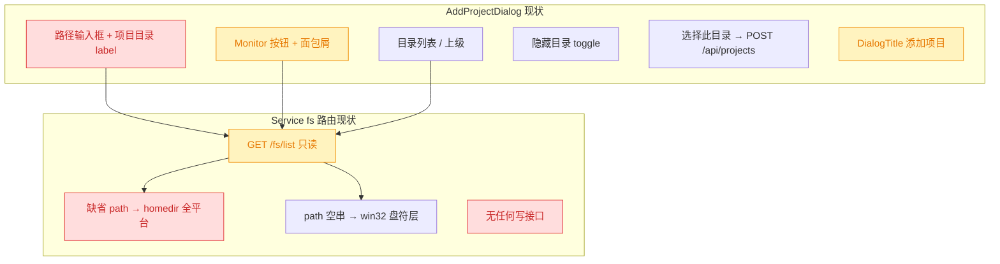
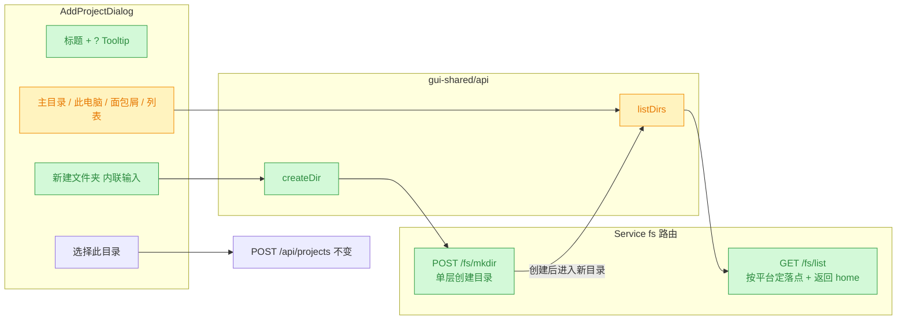
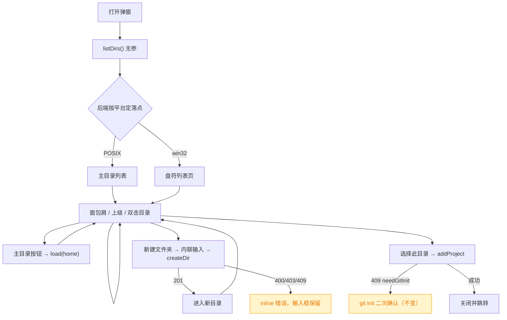
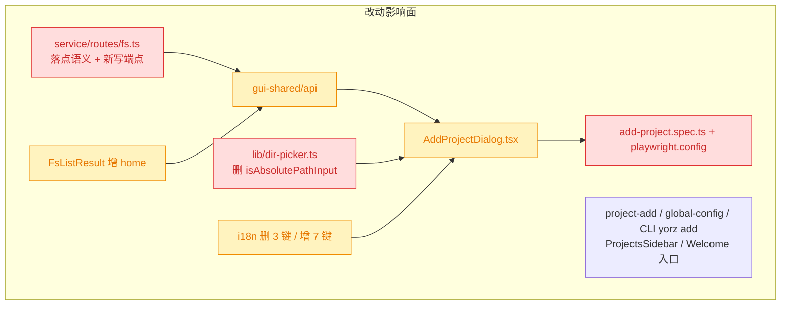

# 添加项目弹窗目录选择体验优化

## 1. 背景

在 `@.yorz/specs/260914.feat.gui-project-dir-picker/spec.md`（已 `done`）中，GUI 已经具备「添加项目 + 本地目录选择器」的完整能力：后端 `GET /api/fs/list` 只读列目录，前端 `AddProjectDialog` 提供面包屑 + 目录列表 + 可编辑路径输入框 + 隐藏目录 toggle + git init 二次确认。

用户实际使用后提出四条体验优化：

1. 添加项目弹窗中，移除「项目目录」label 及输入框；不需要手动输入。
2. macOS / Linux 打开弹窗时默认用户目录，Windows 默认选择盘符页。
3. 支持新建目录。
4. 弹窗标题「添加项目」旁添加一个 `?` icon，hover 提示「也可使用命令 `yorz add <path>` 添加项目」。

本 spec 类型为 `refct`：不改变「添加项目」的后端语义（git 检查 / `git init` / `.gitignore` / 落全局配置均不动），只重构目录选择器的交互形态，并为「新建目录」补一个最小写接口。

## 2. 需求

- 弹窗内不再出现路径输入框与其 label，路径只能通过点选（面包屑 / 列表 / 上级 / 主目录 / 此电脑）产生。
- 打开弹窗的落点按平台区分：POSIX 为用户主目录；Windows 为盘符列表页。
- Windows 上仍可一键回到用户主目录（默认落点变成盘符页后不能让主目录失去入口）。
- 目录选择器内可直接新建目录，创建后进入该目录，可继续「选择此目录」完成添加。
- 弹窗标题旁提供 `?` 图标，hover 展示 CLI 等价命令提示。
- 上述改动必须同时覆盖 win32 路径形态（盘符、反斜杠、UNC），沿用既有「后端返回 `sep`、前端禁止硬编码 `/`」约定。

## 3. 现状分析

结论先行：四条诉求里，**1 与 4 是纯前端改动**；**2 需要后端改默认落点语义并补一个 `home` 字段**（否则 Windows 上主目录将无入口）；**3 需要新增一个写接口**——现有 `fs` 路由是纯只读的，全仓库没有任何「创建目录」的 HTTP 能力。



### 3.1 前端：输入框是当前唯一的「跨树跳转」手段

`AddProjectDialog` 的路径输入框承担三件事：展示当前路径、接受粘贴跳转、回车/失焦触发 `load()`。移除它会连带产生三处涟漪：

- `pathInput` 信号、`gotoInput()` 与 `isAbsolutePathInput()` 全部变成死代码（`isAbsolutePathInput` 仅此一处调用）。
- i18n 的 `addProject.pathLabel` / `pathPlaceholder` / `invalidPath` 三条键失去引用。
- E2E `add-project.spec.ts` 两个用例**都**依赖 `#add-project-path` 输入框把浏览位置跳到 `os.tmpdir()` 下的夹具——输入框一删，用例必然失败，且 tmpdir 无法靠点选从主目录走到。

### 3.2 后端：默认落点写死 homedir，且 home 只存在于服务端

`GET /fs/list` 当前的落点判定是：`path` 未传或空白 → `homedir()`；**仅当 win32 且显式传空串**才返回盘符层。因此 Windows 打开弹窗落在主目录，与诉求 2 相反。

反过来，一旦把 Windows 缺省落点改成盘符层，主目录就失去入口：浏览器不知道服务端的 home 路径，而 `load('')` 在 win32 已被占用为「盘符层」语义。响应体里也没有任何字段承载 home。

### 3.3 后端：fs 路由是纯只读的，没有创建目录的能力

`createFsRoutes()` 只注册了 `GET /fs/list`，实现上刻意避开一切副作用（注释明确写了「不复用 `prepareProjectDir`，因为它会 `mkdir .yorz/specs`」，并有一条「不产生副作用」的单测守着）。「新建目录」无处可落，必须新增端点。

### 3.4 标题区与 Tooltip 基建齐备

`DialogHeader` / `DialogTitle` 现状只渲染一行标题文本。仓库已有 `@src/gui/src/components/ui/tooltip.tsx`（Kobalte Tooltip 封装，`TooltipContent` 带 `z-50` 且走 Portal），`@src/gui/src/components/SystemNotifications.tsx` 有 `openDelay={150} closeDelay={0}` + `TooltipTrigger as={Button}` 的现成范式，直接照抄即可，无需新增依赖。

<details>
<summary>精确层：受影响文件与关键行</summary>

| 文件                                              | 现状                                                                                   |
| ------------------------------------------------- | -------------------------------------------------------------------------------------- |
| `src/gui/src/components/AddProjectDialog.tsx:131` | `label` + `Input#add-project-path`，`onBlur`/`Enter` → `gotoInput()`                   |
| `src/gui/src/components/AddProjectDialog.tsx:150` | 面包屑前的 `Monitor` 图标按钮，`onClick={() => void load('')}`，title 固定为「此电脑」 |
| `src/gui/src/lib/dir-picker.ts:67`                | `isAbsolutePathInput()`，唯一调用点在 `AddProjectDialog`                               |
| `src/service/routes/fs.ts:59`                     | `wantsDriveRoot = isWin && rawPath !== undefined && rawPath.trim() === ''`             |
| `src/service/routes/fs.ts:71`                     | `target = rawPath === undefined \|\| !rawPath.trim() ? homedir() : rawPath`            |
| `src/service/routes/fs.ts:19`                     | `FsListResult { path, parent, sep, entries, truncated }`——无 `home`                    |
| `src/gui-shared/api/index.ts:316`                 | 前端侧 `FsListResult` 镜像类型；`listDirs` / `addProject` 在 `:476` / `:489`           |
| `src/gui/src/i18n/{zh-CN,en}.ts`                  | `addProject.*` 键组，含将被废弃的 `pathLabel` / `pathPlaceholder` / `invalidPath`      |
| `src/gui/src/__e2e__/add-project.spec.ts`         | 两个用例均 `dialog.locator('#add-project-path').fill(...)` 跳到 `tmpdir()` 夹具        |
| `playwright.config.ts:43`                         | `webServer.env` 目前只注入 `YORZ_HOME`，未隔离 `HOME`                                  |
| `src/service/__tests__/fs-routes.test.ts:45`      | 「缺省 path 回落到注入的 homedir」用例注入 `platform: 'darwin'`，本次改动不影响该断言  |

</details>

## 4. 技术实现方案

四条诉求映射为「后端两处（默认落点 + 新建目录）→ API client → 前端组件与纯逻辑 → i18n → 测试」一条链。



### 4.1 后端：按平台区分默认落点，并回传 home

改 `GET /fs/list` 的落点判定，语义收敛为三条：

| `path` 入参  | POSIX       | win32          |
| ------------ | ----------- | -------------- |
| 未传         | `homedir()` | **盘符列表层** |
| 空串         | `homedir()` | 盘符列表层     |
| 具体绝对路径 | 该路径      | 该路径         |

同时在 `FsListResult` 增加 `home: string` 字段（恒为 `normalizeAbsPath(homedir())`，盘符层响应也带上），让前端能无条件渲染「主目录」按钮。这是最小改动：不引入 `platform` 字段（前端已能用 `sep === '\\'` 判定 win32），也不新增端点。

> 决策说明：为何不让前端传 `path=~` 之类的魔法值？魔法值需要前后端各维护一套约定，且与「`path` 必须是绝对路径」的现有校验冲突；回传 `home` 字段是纯增量、零歧义，且顺手让「主目录」按钮在 POSIX 上也有了明确目标（当前 POSIX 上 `load('')` 回落 homedir 属隐式行为）。

### 4.2 后端：新增 `POST /api/fs/mkdir`

`createFsRoutes()` 增注册一个写端点，是本 spec 唯一的新增副作用面：

```
POST /api/fs/mkdir   body: { parent: string, name: string }   → 201 { path }
```

关键约束：

- **单层创建，不递归**：`mkdir(join(parent, name))` 不带 `recursive`，天然拒绝「一次创建多级」和「静默成功于已存在」。
- **`name` 白名单校验**（抽出可测纯函数 `validateDirName(name, platform)`）：非空、去空白后非空、不含 `/` 与 `\`、不是 `.` / `..`、长度 ≤ 255、无控制字符；win32 额外拒绝 `<>:"|?*` 与保留名（`CON`/`PRN`/`AUX`/`NUL`/`COM1`–`COM9`/`LPT1`–`LPT9`）及尾随点号/空格。
- **`parent` 复用 list 的校验链**：`isAbsolute` → `normalizeAbsPath` → `stat` 且 `isDirectory()`；win32 盘符列表层（空串）直接 400（不能在「此电脑」层建目录）。
- **错误码映射**：`EEXIST` → 409、`EACCES`/`EPERM` → 403、其余沿用 `describeFsError()` → 400。
- 响应回传归一化后的新目录绝对路径，前端据此直接 `load(path)` 进入。

> 决策说明：为何新增写接口而非复用 `POST /api/projects`？后者会在建目录的同时把项目落进全局配置并触发 git 流程，语义上是「添加项目」而非「建目录」；用户可能只是想先建一层父目录再往下走。且 `POST /projects` 现有校验要求路径已存在，复用需要放宽它的入参约束，反而扩大了影响面。
>
> 决策说明（写接口的安全取舍）：新端点可在任意可写位置创建**单层空目录**。风险面小于既有 `POST /api/projects`（后者已能建目录 + 落配置 + 跑 `git init`），且 Service 强制回环监听（`DEFAULT_HOST = '127.0.0.1'`，非回环直接抛错），与前序 spec 已确认接受的「只读枚举面扩大」处于同一暴露层级。故按上述白名单校验直接实施，不作为待确认项。

<details>
<summary>精确层：新增/变更的类型定义与路由骨架</summary>

```ts
// src/service/routes/fs.ts
export interface FsListResult {
  path: string
  parent: string | null
  sep: string
  /** 服务端用户主目录（已归一化）；供前端渲染「主目录」按钮，盘符层响应也带。 */
  home: string
  entries: FsListEntry[]
  truncated: boolean
}

/** 目录名白名单校验；win32 额外拒绝保留字符 / 保留名 / 尾随点号与空格。 */
export function validateDirName(name: string, platform: NodeJS.Platform): string | null
// 返回 null 表示合法，否则返回可读错误原因

// POST /fs/mkdir
// body: { parent: string; name: string }
// 201 { path: string } | 400 { error } | 403 { error } | 409 { error }
```

win32 保留名正则：`/^(con|prn|aux|nul|com[1-9]|lpt[1-9])(\.|$)/i`；尾随点号/空格：`/[. ]$/`。

</details>

### 4.3 前端：API client 与纯逻辑

- `@src/gui-shared/api/index.ts`：镜像类型 `FsListResult` 补 `home`；新增 `createDir(parent, name): Promise<{ path: string }>`（`POST /api/fs/mkdir`，非 2xx 沿用 `extractErrorDetail` 抛错，由调用方展示 inline 错误）。
- `@src/gui/src/lib/dir-picker.ts`：**删除** `isAbsolutePathInput`（随输入框一起消失，避免死代码），**新增** `isValidDirName(name)` 做前端预校验（非空、不含 `/` 与 `\`、不是 `.` / `..`）——仅用于即时禁用「创建」按钮，权威校验仍在后端。`splitBreadcrumb` / `joinDir` 不变。

### 4.4 前端：AddProjectDialog 交互重排



具体改动：

- **标题区**：`DialogTitle` 外包一层 `flex items-center gap-1.5`，右侧放 `Tooltip`（`openDelay={150} closeDelay={0}`）+ `TooltipTrigger as={Button} variant="ghost" size="icon"` + `HelpCircle`（`lucide-solid`），`TooltipContent` 渲染 `t('addProject.helpTooltip')`。按钮带 `aria-label` 以便 E2E/无障碍定位。
- **删除路径输入框**：连同 `label`、`pathInput` 信号、`gotoInput()` 一并移除；`load()` 内不再 `setPathInput`。当前路径改由面包屑承担展示职责。
- **导航按钮组**：面包屑前固定放「主目录」按钮（`Home` 图标，`load(listing().home)`）；`sep === '\\'` 时额外放「此电脑」按钮（`Monitor` 图标，`load('')`）。POSIX 下不再渲染 `Monitor`（其 `load('')` 在 POSIX 语义上就是回主目录，与新按钮重复）。
- **新建文件夹**：目录列表上方一行工具条右侧放 `FolderPlus` 按钮；点击后就地展开一个 `Input` + 「创建」/「取消」，`Enter` 提交、`Esc` 取消。成功后 `load(res.path)` 进入新目录并收起输入；失败把后端 error 文案写进既有 `error()` inline 区域，输入内容保留。盘符列表层（`currentDir() === null`）下禁用该按钮。
- 其余（隐藏目录 toggle、列表、`选择此目录`、git init 二次确认、错误区）保持不变。

### 4.5 i18n

`@src/gui/src/i18n/{zh-CN,en}.ts` 的 `addProject` 键组：

- 删除：`pathLabel`、`pathPlaceholder`、`invalidPath`。
- 新增：`help`（`?` 按钮 aria-label）、`helpTooltip`（「也可使用命令 \`yorz add <path>\` 添加项目」）、`home`（「主目录」）、`newFolder`（「新建文件夹」）、`newFolderPlaceholder`（「文件夹名称」）、`newFolderConfirm`（「创建」）、`invalidName`（「名称不能为空，且不能包含路径分隔符」）。
- 保留：`driveRoot`（「此电脑」，win32 专用）。

移动端 i18n 与 `src/gui-mobile/` 不动（移动端本就没有添加入口）。

### 4.6 测试策略与 E2E 的连带改造

| 层         | 文件                                           | 改动                                                                                  |
| ---------- | ---------------------------------------------- | ------------------------------------------------------------------------------------- |
| 后端路由   | `src/service/__tests__/fs-routes.test.ts`      | 补：win32 缺省落点为盘符层、POSIX 缺省仍为 home、响应含 `home` 字段                   |
| 后端 mkdir | 同上（新 `describe`）                          | 覆盖成功建目录、非法名 400、`..` 400、已存在 409、parent 不存在 400、win32 保留名 400 |
| 前端纯逻辑 | `src/gui/src/lib/__tests__/dir-picker.test.ts` | 删 `isAbsolutePathInput` 用例，加 `isValidDirName` 用例                               |
| E2E        | `src/gui/src/__e2e__/add-project.spec.ts`      | **必须重写导航方式**（见下）                                                          |

**E2E 导航方式改造（本 spec 的主要风险点）**：输入框删除后，测试无法再跳到 `os.tmpdir()` 夹具，而默认落点是服务端的 `homedir()`。处置：在 `playwright.config.ts` 的 `webServer.env` 追加 `HOME` / `USERPROFILE` 指向仓库内的隔离目录（与既有 `YORZ_HOME: E2E_HOME` 同构），由 `fixtures/seed.mjs` 预先 `mkdir`，`globalTeardown` 清理。Node 的 `os.homedir()` 在 POSIX 上优先取 `$HOME`，故 Service 的默认落点即落在该隔离目录，用例可在其中造夹具并全程点选。

> 决策说明：不采用「把夹具建到用户真实 `$HOME` 下」的省事做法——会污染用户主目录，且用例中断时残留。隔离 `HOME` 与仓库既有 `YORZ_HOME` 隔离手法一致，风险可控（`git init` 不依赖全局 git 配置）。

E2E 用例重排为三条：`浏览并添加 git 项目`（点选进入夹具子目录）、`非 git 目录二次确认后 git init`、`新建目录后直接添加`（点「新建文件夹」→ 输名 → 进入 → 「选择此目录」→ 走 git init 确认）。既有约定不变：中文文案定位、`[role="dialog"]` 选择器（`DialogContent` 不展开 `rest`，`data-testid` 会被丢弃）、用例自清理注册的项目。

### 4.7 兼容性与影响范围



- 🔴 **行为变更**：Windows 上弹窗默认落点由主目录改为盘符页（正是诉求 2）；手输/粘贴路径能力被移除（正是诉求 1，属有意取舍——深层路径需多次点选，但换来零输入的确定性）。
- 🔴 **删除导出**：`isAbsolutePathInput` 被删，需确认无其它引用（当前仅 `AddProjectDialog` 一处）。
- 🟡 **类型扩展**：`FsListResult` 增 `home` 为纯增量字段，前后端镜像类型需同步。
- 未触及：`POST /api/projects` 的添加语义、`project-add.ts`、`global-config.ts`、CLI `yorz add`、侧边栏/空态页入口按钮。

## 5. 待确认项

_暂无_

## 6. 任务清单

- [x] `src/service/routes/fs.ts` 调整默认落点：`path` 未传时 win32 返回盘符列表层、POSIX 返回 `homedir()`（验收：注入 `platform:'win32'` 无 `path` 请求返回 `path: ''` 且 `entries` 为盘符）
- [x] `src/service/routes/fs.ts` 的 `FsListResult` 增加 `home` 字段并在所有分支（含盘符层）回填归一化后的 `homedir()`（验收：两类响应均含 `home`）
- [x] `src/service/routes/fs.ts` 新增导出 `validateDirName(name, platform)`：空/空白、含 `/` 或 `\`、`.`/`..`、长度 > 255、控制字符一律拒绝；win32 额外拒 `<>:"|?*`、保留名与尾随点号空格（验收：单测覆盖各分支）
- [x] `src/service/routes/fs.ts` 新增 `POST /fs/mkdir`：校验 parent（绝对/存在/是目录，盘符层拒绝）与 name，非递归 `mkdir`，成功 201 返回归一化 `path`，`EEXIST` 409、`EACCES`/`EPERM` 403、其余 400（验收：路由测试全绿）
- [x] `src/service/__tests__/fs-routes.test.ts` 补 list 用例：win32 缺省落点为盘符层、POSIX 缺省仍为注入 home、响应含 `home` 字段（验收：`vitest run` 通过）
- [x] `src/service/__tests__/fs-routes.test.ts` 新增 `POST /fs/mkdir` 用例：成功创建、名称含分隔符 400、`..` 400、已存在 409、parent 不存在 400、win32 保留名 400（验收：`vitest run` 通过）
- [x] `src/gui-shared/api/index.ts`：镜像 `FsListResult` 补 `home`，新增 `createDir(parent, name)` 调 `POST /api/fs/mkdir` 并复用 `extractErrorDetail` 抛错（验收：`tsc -b` 通过）
- [x] `src/gui/src/lib/dir-picker.ts`：删除 `isAbsolutePathInput`，新增 `isValidDirName(name)`（非空、不含 `/` 与 `\`、非 `.`/`..`）（验收：grep 无 `isAbsolutePathInput` 残留引用）
- [x] `src/gui/src/lib/__tests__/dir-picker.test.ts`：移除 `isAbsolutePathInput` 用例，新增 `isValidDirName` 用例（验收：`vitest run` 通过）
- [x] `AddProjectDialog.tsx` 移除路径输入框：删除 label、`Input#add-project-path`、`pathInput` 信号与 `gotoInput()`，`load()` 不再 `setPathInput`（验收：`tsc -b` 通过且组件无未使用变量告警）
- [x] `AddProjectDialog.tsx` 标题区加 `?` 图标：`HelpCircle` + `Tooltip`（`openDelay={150} closeDelay={0}`）+ `aria-label`，内容取 `addProject.helpTooltip`（验收：hover 出现 CLI 提示文案）
- [x] `AddProjectDialog.tsx` 导航按钮组：固定渲染「主目录」按钮（`Home` 图标 → `load(listing().home)`），仅 `sep === '\\'` 时额外渲染「此电脑」按钮（`Monitor` 图标 → `load('')`）（验收：POSIX 下不出现「此电脑」按钮）
- [x] `AddProjectDialog.tsx` 新建目录：工具条加 `FolderPlus` 按钮，展开内联 `Input` + 创建/取消，`Enter` 提交 / `Esc` 取消，成功后 `load(res.path)` 进入新目录，失败写 inline 错误并保留输入；盘符层禁用（验收：`tsc -b` 通过，交互路径手测可走通）
- [x] `src/gui/src/i18n/{zh-CN,en}.ts`：删除 `addProject.pathLabel`/`pathPlaceholder`/`invalidPath`，新增 `help`/`helpTooltip`/`home`/`newFolder`/`newFolderPlaceholder`/`newFolderConfirm`/`invalidName`（验收：两语言键集一致，无缺键、无未引用残留）
- [x] `playwright.config.ts` 的 `webServer.env` 追加隔离 `HOME`/`USERPROFILE`，`fixtures/seed.mjs` 预建该目录、`fixtures/teardown.ts` 清理（验收：`playwright test` 启动后 `GET /api/fs/list` 默认落点在隔离目录）
- [x] 重写 `src/gui/src/__e2e__/add-project.spec.ts`：夹具建在隔离 HOME 内，全程点选导航；三条用例（点选添加 git 项目 / 非 git 二次确认 / 新建目录后添加）并自清理项目（验收：`playwright test add-project` 通过）
- [x] 全量校验：`pnpm typecheck` + `pnpm test` + `pnpm run build`（验收：均无失败）

## 7. 追加任务

- [done] [fix] 2026-09-14 19:35:45 | 新建目录时，创建/取消 两个按钮宽度太小，文字显示不下
  - 描述：新建目录时，创建/取消 两个按钮宽度太小，文字显示不下
  - 处置：见 `debug.md` 的 `## Debug 1`。根因为新建文件夹行中 `Input` 的 `w-full` 独占 100% 行宽，两个 Button 未设 `shrink-0` 被 flex 按比例压缩到自然宽度以下（44→38.66 / 46→40.66），而 `<button>` 不受 `min-width:auto` 自动最小尺寸保护，文字遭横向裁切。修复：两个 Button 加 `class="shrink-0"`（`AddProjectDialog.tsx:259-275`）。
- [done] [fix] 2026-09-14 19:45:07 | 打开弹窗时，添加项目的 tips（命令行说明）默认显示，此时鼠标并未hover icon；
  - 描述：打开弹窗时，添加项目的 tips（命令行说明）默认显示，此时鼠标并未hover icon；
  - 处置：见 `debug.md` 的 `## Debug 2`。根因为 Kobalte Dialog 挂载时自动聚焦容器内首个可 Tab 元素（恰是标题旁的 `?` 按钮），而 Kobalte `TooltipTrigger` 对任何聚焦（含程序化聚焦）都展开提示、不区分 `:focus-visible`。修复：`ui/dialog.tsx` 的 `DialogContent` 补 `{...rest}` 透传（原先其余 props 被静默丢弃），`AddProjectDialog.tsx` 挂 `onOpenAutoFocus` → `preventDefault()` 后改聚焦对话框容器（`tabIndex=-1`，Kobalte 自身兜底分支）。Tab 序列与 hover 行为不变，`add-project.spec.ts` 补「hover 前提示必须隐藏」的回归断言。

## 8. 执行记录

- 后端落点与 `home`：`src/service/routes/fs.ts` 的 `GET /fs/list` 落点判定改为 `blank = path 未传或空白`——win32 一律返回盘符列表层，POSIX 回 `homedir()`；`FsListResult` 新增 `home`（`normalizeAbsPath(homedir())`），盘符层分支同样回填。
- 后端新建目录：新增 `POST /fs/mkdir`（非递归 `mkdir`，`EEXIST` 409 / `EACCES`·`EPERM` 403 / 其余 400）与导出的纯函数 `validateDirName(name, platform)`（空、`.`/`..`、分隔符、超长、控制字符；win32 额外拒 `<>:"|?*`、`CON`/`COM1` 等保留名、尾随点号空格）。
- 前端 API：`gui-shared/api` 的 `FsListResult` 镜像补 `home`，新增 `createDir(parent, name)`。
- 前端纯逻辑：`lib/dir-picker.ts` 删除 `isAbsolutePathInput`（随输入框一起消失），新增 `isValidDirName`；单测同步替换。
- 组件重构：`AddProjectDialog.tsx` 移除「项目目录」label 与路径输入框及 `gotoInput()`；标题区加 `HelpCircle` + Tooltip（`也可使用命令 yorz add <path> 添加项目`）；导航区固定「主目录」按钮、仅 win32 追加「此电脑」；工具条加 `FolderPlus` 内联新建目录（Enter 提交 / Esc 取消，创建成功后直接进入新目录）。
- 修掉一个被旧测试掩盖的缺陷：弹窗由调用方信号受控，Kobalte 的 `onOpenChange` 在外部置 `open=true` 时不会触发，首帧根本没发起目录请求；旧 E2E 因为总会手输路径才没暴露。改为 `createEffect(on(() => props.open, ...))` 驱动初始加载与重置。
- i18n：删 `pathLabel`/`pathPlaceholder`/`invalidPath`，加 `help`/`helpTooltip`/`home`/`newFolder`/`newFolderPlaceholder`/`newFolderConfirm`/`invalidName`（中英对齐）。
- E2E 基建：`playwright.config.ts` 的 `webServer.env` 追加 `HOME`/`USERPROFILE` → `.tmp-e2e-fs-home`（`seed.mjs` 预建、`teardown.ts` 清理、`seed.d.mts` 补类型），让「缺省落点 = 主目录」可控且不污染真实 `~`。
- E2E 用例：`add-project.spec.ts` 重写为全程点选导航的三条用例（点选添加 git 项目含 `?` tooltip 断言 / 非 git 二次确认 `git init` / 新建目录后添加），`playwright test add-project` 3 例通过。
- 全量验证：`tsc -b` 通过；`vitest run` 95 文件 / 966 通过 2 跳过；`pnpm run build` 成功；`playwright test` 全量 57 通过 1 失败。
- 失败项归属：`sidebar-hover-peek.spec.ts` 的宽度断言（期望 37.55 实际 36）与本 spec 无关——改动未触及侧边栏与样式；其 `collapseSidebar()` 用 `poll(width < 40)` 判定折叠完成，会 latch 到 150ms 宽度过渡的中间值（w-9 = 36px）。空载连跑三轮出现 2 次通过 1 次失败，属既有 flaky 用例，未在本轮范围内修复。
- 收尾：任务清单全部完成，待确认项为空，`stage` 置 `done`。
