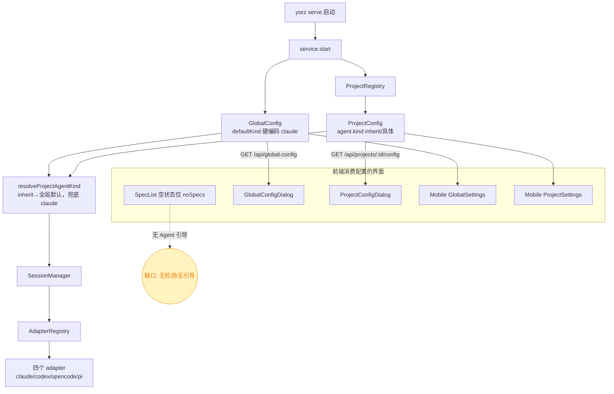
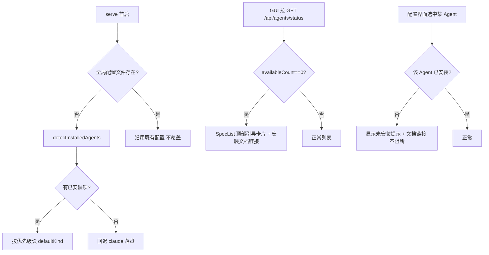
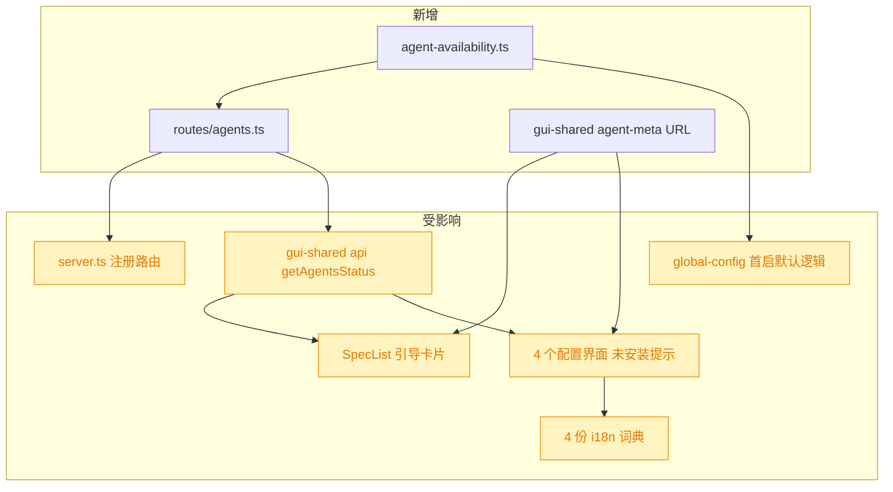

# 初始 Agent 引导功能

## 1. 背景

YorZ 依赖本地安装的 AI Agent CLI（ClaudeCode / Codex / OpenCode / Pi）来驱动 spec 工作流。当前 `yorz serve` 启动后并不检测用户本地是否安装了任何 Agent，全局默认 Agent 固定为 `claude`。若用户从未安装任何 Agent，或把默认 Agent 切到了本机未安装的类型，界面缺少明确引导，用户会遇到「点了没反应 / 报错难懂」的困惑。

## 2. 需求

1. 初始启动 `yorz serve` 时，检测用户本地 Agent 安装情况。
2. 若没有安装任何 Agent，在 `src/gui/src/pages/SpecList.tsx` 页面显示 YorZ 支持的 Agent 列表及对应安装文档链接，引导用户安装配置 Agent。
3. 若已安装可用 Agent，初始启动时将 YorZ 系统默认 Agent 设为已安装项，优先级：ClaudeCode > Codex > OpenCode > Pi。
4. 在（系统设置、项目设置）中切换到未安装的 Agent 时，提示当前 Agent 未安装，并提供对应安装文档链接。

涉及界面：

- `src/gui/src/pages/SpecList.tsx`
- `src/gui/src/components/GlobalConfigDialog.tsx`
- `src/gui/src/components/ProjectConfigDialog.tsx`
- `src/gui-mobile/src/pages/settings/GlobalSettings.tsx`
- `src/gui-mobile/src/pages/settings/ProjectSettings.tsx`

## 3. 现状分析

YorZ 当前**没有任何「本地 Agent 安装/可用性」检测**，系统默认 Agent 全程硬编码为 `claude`，五个前端界面固定展示 claude / codex / opencode / pi 四项、不感知本机实际能用哪个。下图是与本需求相关的现有链路（无检测节点）：



**关键事实：四个 Agent 的运行时定位方式不同**，这直接决定「安装/可用」的检测语义——只有 OpenCode 命中经典「PATH 里是否装了 CLI」语义，其余三者随 YorZ 一起 bundled，二进制层面基本恒在，用户真正要做的是「登录/配置凭证」而非「安装」。

<details>
<summary>各 Agent 运行时定位与失败形式（精确层）</summary>

| Agent    | 运行时定位                                                                                                | 是否依赖系统 PATH CLI              | 未就绪时的失败点                                                                                                          |
| -------- | --------------------------------------------------------------------------------------------------------- | ---------------------------------- | ------------------------------------------------------------------------------------------------------------------------- |
| claude   | `@anthropic-ai/claude-agent-sdk` bundled 平台包 `@anthropic-ai/claude-agent-sdk-<platform>-<arch>/claude` | 否（bundled，恒在）                | 首次 `query()` 抛错，被 `send()` catch 成 error 事件（`src/service/agent-sdk/claude-adapter.ts:165,253-255`）             |
| codex    | `@openai/codex-sdk` → `@openai/codex` vendored 二进制 `vendor/<triple>/bin/codex`                         | 否（bundled，恒在）                | 首次 `runStreamed()` spawn 抛错（`src/service/agent-sdk/codex-adapter.ts:232,265-267`）                                   |
| opencode | `@opencode-ai/sdk` 用 cross-spawn 启动裸命令 `opencode serve`                                             | **是**（PATH 里必须有 `opencode`） | `ensure()` 启动失败 reject（ENOENT/超时），`createSession` 阶段抛出（`src/service/agent-sdk/opencode-adapter.ts:94-117`） |
| pi       | `@earendil-works/pi-coding-agent` 纯 JS 库、进程内运行                                                    | 否（npm 包，恒在）                 | `ensureRuntime()` 读 auth/模型失败，被 `send()` catch（`src/service/agent-sdk/pi-adapter.ts:390-403,203-210`）            |

- `AgentKind` 权威定义：`src/service/agent-sdk/types.ts:3`（`'claude'|'codex'|'opencode'|'pi'`）；CLI 名映射（仅测试用）`src/service/agent-config.ts:73-132` 的 `BUILTIN`。
- 全局默认硬编码 `claude`：`src/service/global-config.ts:86,212,235`；前端默认 `src/gui/src/lib/global-config.ts:7-9`。
- 项目级解析 `resolveProjectAgentKind`：`src/service/project-registry.ts:274`。
- 后端路由聚合 `createApp`：`src/service/server.ts:38-138`（子路由 `api.route('/', createXxxRoutes())`）。
- 前端 API client（真值）：`src/gui-shared/api/index.ts`（`getGlobalConfig`/`updateGlobalConfig`/`getProjectConfig`/`updateProjectConfig`）；桌面 `src/gui/src/lib/api.ts` 仅 re-export。
- 无第三方 `which`/`execa`；可复用 `src/service/process.ts` 的 `execFileWithoutWindow` 跑 `which`/`command -v`/`where`。
- 代码中无任何 Agent 安装文档 URL（需新引入）。

</details>

## 4. 技术实现方案

新增一个「Agent 可用性检测 + 首启默认选择 + 前端引导/提示」的贯穿链路。**注意**：因 claude/codex/pi 运行时随 YorZ bundled、二进制层面恒在，「安装/可用」的判定口径存在多个可行解且影响面大，作为 [choice] 列入待确认项（见 5.1）。以下方案先按**推荐口径**（PATH 同名 CLI 作为「用户是否已安装并配置该 Agent」的代理指标）落地，若最终选定其它口径，仅替换 4.1 的检测实现，其余分层不变。

### 4.1 检测层（新增，service）

新增 `src/service/agent-availability.ts`（暂名），导出：

- `AGENT_PRIORITY: readonly AgentKind[] = ['claude', 'codex', 'opencode', 'pi']`（优先级来源，需求指定）。
- `detectInstalledAgents(): Promise<Record<AgentKind, boolean>>`：对四个 kind 逐一判定「是否已安装」。推荐口径下 = 用 `execFileWithoutWindow` 跑跨平台 PATH 查找（unix `command -v <cmd>` / win `where <cmd>`），`cmd` 取自 `BUILTIN[kind].cmd`（`claude`/`codex`/`opencode`/`pi`）。结果做进程级短时缓存（避免每次请求都探测）。
- `resolveDefaultInstalledKind(status): AgentKind | null`：按 `AGENT_PRIORITY` 取第一个 `installed===true` 的 kind；全未安装返回 `null`。

### 4.2 后端 API（新增路由）

新增 `src/service/routes/agents.ts` 导出 `createAgentsRoutes()`，在 `src/service/server.ts` 的子路由区注册 `api.route('/', createAgentsRoutes())`：

- `GET /api/agents/status` → `{ agents: { kind: AgentKind; installed: boolean }[]; defaultInstalled: AgentKind | null }`。docUrl 不放后端（静态、与 i18n 无关），由前端常量承载。

### 4.3 首启系统默认 Agent（服务端，仅首次）

在全局配置**首次创建**（配置文件不存在）路径中，把默认 `defaultKind` 从硬编码 `claude` 改为「按优先级取已安装项」：`loadGlobalConfig()` 发现文件缺失且需落盘时，调用 `detectInstalledAgents()` → `resolveDefaultInstalledKind()`，命中则用之，全未安装则回退 `claude`（GUI 会展示引导）。**只在首启生成配置时生效，绝不覆盖用户已持久化的选择**（无法区分「用户选了 claude」与「历史默认」，覆盖会破坏用户意图）。

> 决策记录：默认 Agent 自动选择只在首启（全局配置文件不存在）时进行，不在后续启动覆盖既有配置；理由：现有 `defaultKind` 恒有值、无法区分显式选择与默认兜底，覆盖有副作用。需求 #4 的「切到未安装 Agent」由前端提示承载，不做自动改写。

### 4.4 前端共享层（gui-shared）

- `src/gui-shared/api/index.ts` 增 `getAgentsStatus(): Promise<AgentsStatus>` 及类型 `AgentsStatus`。
- 新增共享常量模块（如 `src/gui-shared/lib/agent-meta.ts`）：`AGENT_DOC_URLS: Record<AgentKind, string>` + 复用现有 label。桌面与移动端共用。

<details>
<summary>安装文档 URL 常量（精确层）</summary>

```ts
export const AGENT_DOC_URLS = {
  claude: 'https://code.claude.com/docs/en/setup',
  codex: 'https://developers.openai.com/codex/cli',
  opencode: 'https://opencode.ai/docs/',
  pi: 'https://pi.dev/',
} as const
```

来源：各 Agent 官方安装/设置文档页（2026-09 核对）。

</details>

### 4.5 前端界面改造（消费检测结果）

各界面拉取 `getAgentsStatus()`（`createResource`，可加共享缓存避免重复请求）：

- **SpecList.tsx（需求 #2）**：`availableCount===0` 时，在页面顶部展示「Agent 引导卡片」——复用现有 `noSpecs` 虚线卡片范式（`border-dashed` + 文案 + 行动），列出四个 Agent 名称 + 各自安装文档链接。无 spec 且无 Agent 时该卡片取代 `createFirst` 空状态；有 spec 但无 Agent 时作为顶部横幅提示。
- **GlobalConfigDialog / ProjectConfigDialog / Mobile Global/Project Settings（需求 #4）**：Agent 选项渲染时，对 `installed===false` 的项追加「未安装」标注；当前选中项未安装时，在其下方显示提示文案 + 对应安装文档链接（`AGENT_DOC_URLS[kind]`）。**仅提示，不阻断切换**（允许用户切到未安装项，与需求「提示 + 文档链接」一致）。

### 4.6 i18n

在桌面 `src/gui/src/i18n/{zh-CN,en}.ts` 与移动 `src/gui-mobile/src/i18n/{zh-CN,en}.ts` 对齐新增文案：引导卡片标题/说明、「安装文档」链接文案、「未安装」标注、「当前 Agent 未安装」提示。Agent 名称复用现有 `projectConfig.agent*` label。

### 4.7 决策流与影响面





> 影响面均为**加法式**改造（新增检测/路由/常量 + 在既有界面挂载新 UI 与首启默认逻辑），无破坏性变更（无 breaking 红区）：不改 `AgentKind` 值集合、不改现有配置读写契约、不阻断任何既有交互。

## 5. 待确认项

### 5.1 [choice] 「本地 Agent 安装/可用」应采用哪种检测口径？

> 背景：claude / codex / pi 的运行时随 YorZ 一起 bundled（平台二进制 / npm 库），二进制层面基本恒在，用户真正要做的是登录配置；只有 opencode 依赖系统 PATH 安装。口径选择决定「无 Agent 引导」是否会触发、默认优先级是否有意义，且是整个检测层的架构基线，选错返工面大，故请抉择：

1. 按运行时二进制可定位性检测：claude/codex 查 bundled 平台二进制、pi 查 npm 包、opencode 查 PATH。技术最准，但 claude/codex/pi 随 YorZ 恒在，「无 Agent」几乎不触发、优先级选择基本失效，需求 #2 引导列表形同虚设
2. 按「已认证可运行」检测：探测各 Agent 登录态/凭证文件。最贴合「能用的 Agent」直觉、引导最有意义，但需 agent-specific 凭证探测（各自 auth 路径/env），成本高、易误判（企业代理、自定义 env）
3. 按 PATH 同名 CLI 统一检测（claude/codex/opencode/pi 是否在 PATH），作为「用户是否已安装并配置该 Agent」的代理指标：贴合需求字面与「安装文档」引导模型、低成本、四端一致；缺点是与真实 bundled 运行时脱节，可能对「仅用 API Key、未装 CLI」的 claude/codex 用户误报未安装 （推荐）

## 6. 任务清单

_暂无_

## 7. 执行记录

_暂无_
