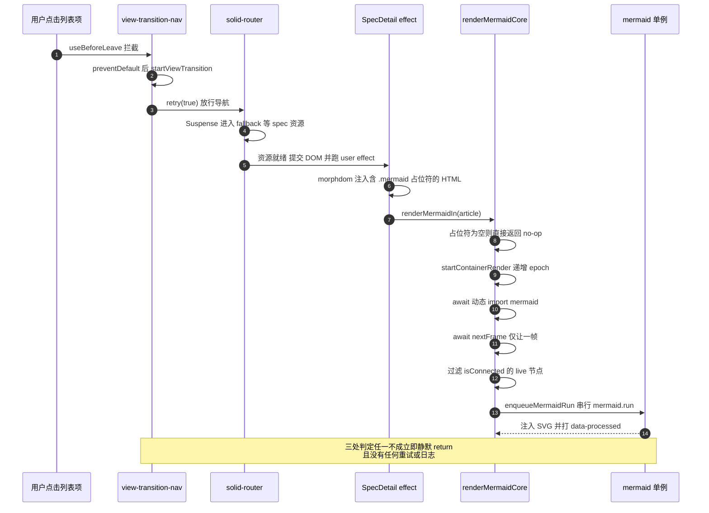
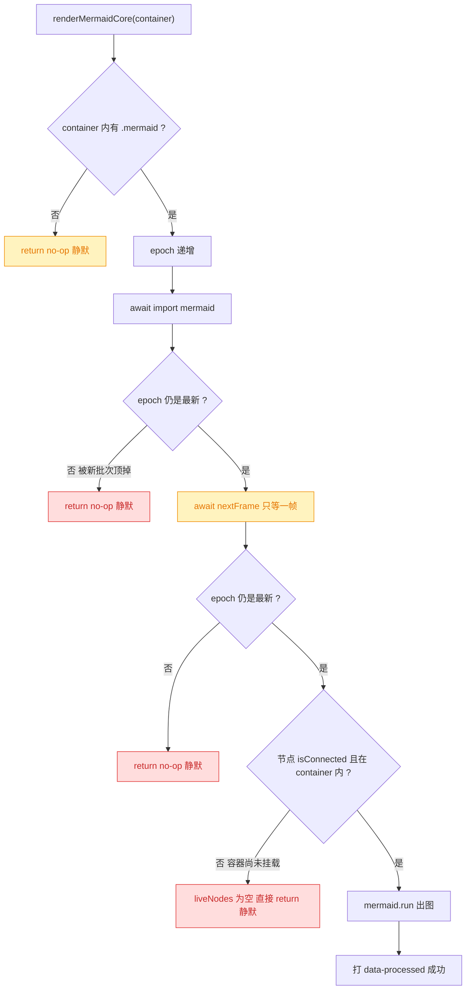
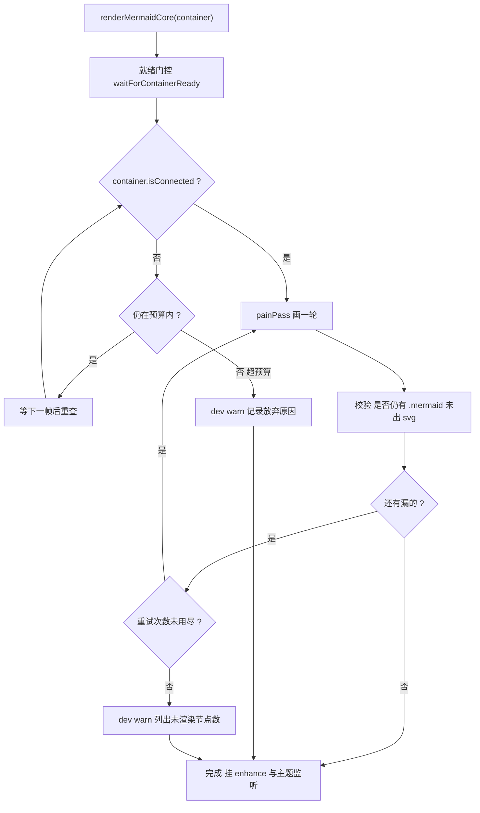
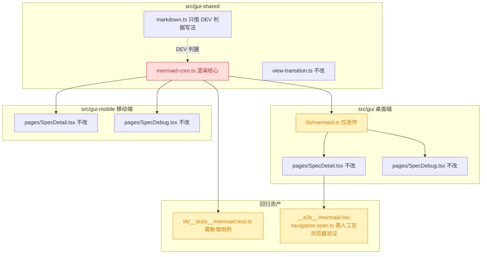

# 260915.fix.spec-detail-mermaid-nav-blank

## 1. 背景

用户反馈（原始需求）：

> `src/gui/src/pages/SpecDetail.tsx` 在 spec 列表页点进详情页几率无法渲染 mermaid 图形，控制台无警告/报错信息；刷新页面正常渲染。

这是一个**复发问题**。同一现象（列表页客户端导航进详情页 → mermaid 不出图；刷新正常）在 `260719.refct.spec-detail-incremental-dom-update` 的 debug 流程中已处理过一次，当时的表现是**有报错**：

- 报错文本：`[mermaid] render error: Cannot read properties of null (reading 'namespaceURI')`
- 修复提交：`889936b fix: mermaid render error`
- 该 debug.md 的「收尾核对」第一项 `稳定复现路径 A 并确认路径 B 正常` **未勾选**，原因是当时沙箱禁止端口监听 / 启动 Chromium，真实浏览器验证被阻断。

即：上一轮修复是在**未取得浏览器级根因证据**的前提下加的防御性守卫，把「报错」压成了「静默失败」。本次现象「无警告/无报错」正是那批守卫命中后无人兜底的直接后果。

上一轮 debug 的假设看板与结论（原文摘要）

- H1：morphdom 以 HTML 字符串作 `toNode` 导致对照节点上下文异常 —— 未采用，证据不足。
- H2：旧 effect cleanup 与新 render Promise 交错，同容器并发调用 mermaid 单例 —— 单元证据支持，遂引入 epoch + 串行队列。
- H3：article effect 早于真实布局稳定，对隐藏/未布局容器渲染失败 —— 「已防御，浏览器待验」。

引入的三项守卫（均为**静默 return**）：同容器 render epoch、`node.isConnected && container.contains(node)` 过滤、全局 `mermaid.run` 串行化。

## 2. 需求

- 从 spec 列表页（`/:projectId`）点击进入详情页（`/:projectId/specs/:id`）时，mermaid 图形必须稳定渲染，不再出现概率性不出图。
- 渲染管线**不允许静默放弃**：任何「本次没画」的分支都要么自愈重试，要么留下可诊断的日志。
- 修复须同时覆盖桌面端 `src/gui` 与移动端 `src/gui-mobile`（两端共用 `renderMermaidCore`），以及 `SpecDetail` / `SpecDebug` 两个使用页。
- 不回退既有能力：SSE 增量刷新时未变更的图不重绘、主题切换整体重绘、桌面端全屏控件、滚动位置不跳。

## 3. 现状分析

### 3.1 渲染管线与触发时序

列表页 → 详情页是**客户端路由 + View Transition + Solid transition + Suspense** 四件事叠在一起；刷新则是首屏同步挂载，四件事全都不发生 —— 这就是「导航偶发失败、刷新必成功」的差异来源。

### 3.2 四条「静默放弃」路径

四条路径的共同缺陷：**一次性、无重试、无日志**。effect 不会因为「这次没画成」而重新触发（`spec()` / `articleEl()` 都没变），于是占位符永久停在未渲染态，直到用户刷新或切换主题（`rerenderAll` 会重扫全部 `.mermaid`）才复活 —— 与用户描述完全吻合。

其中最可疑的是 `Bail4`：`await nextFrame()` 这一帧是上一轮针对 H3 的**猜测式**缓解（源码注释自陈「Solid may assign the ref before the article is fully connected/paintable … yield one frame」）。一帧够不够，取决于 View Transition 的 update callback 何时 settle、Solid transition 的 `Transition.effects` 何时 flush —— 都是不可控的外部时序，所以表现为「概率性」。

`Bail2` / `Bail3` 同样有洞：epoch 保证「最新批次赢」，但**不保证最新批次真的画成**。若最新批次自己撞上 `Bail4`，则先前那个本来能画成的批次已被它顶掉，最终一张图都没有。

### 3.3 关键约束（实施时必须遵守）

相关文件、行号与既有不变量

- `src/gui-shared/lib/mermaid-core.ts`：两端共用渲染核心。
  - `L75` `if (container.querySelector('.mermaid') === null) return () => {}`
  - `L77` `startContainerRender(container)` / `L60` `isCurrentContainerRender`
  - `L83` `await nextFrame()` ← 猜测式一帧
  - `L93` `nodes.filter((node) => node.isConnected && container.contains(node))`
  - `L98` `liveNodes.filter(...)` 二次过滤
  - `L117` `await mermaid.run({ nodes: currentNodes })`，`L120` 仅此处有 `console.error`
  - `L130` `pending = container.querySelectorAll('.mermaid:not([data-processed])')` —— 增量语义，必须保留
  - `L141` `rerenderAll` 主题切换时重扫全部 `.mermaid`，会移除 `data-processed`
- `src/gui/src/lib/mermaid.ts:305` `renderMermaidIn` = core + 桌面端全屏控件 `enhance`
- `src/gui/src/pages/SpecDetail.tsx:229-268` morphdom + `renderMermaidIn` 的 effect；`onBeforeElUpdated` 靠 `data-mermaid-source` 相等来保住已渲染 SVG
- 其余调用点：`src/gui/src/pages/SpecDebug.tsx:61`、`src/gui-mobile/src/pages/SpecDetail.tsx:234`、`src/gui-mobile/src/pages/SpecDebug.tsx:56`
- `src/gui-shared/lib/view-transition.ts`：模块级 `let current: ViewTransition | null`，未对外暴露「过渡是否在途」
- 既有回归资产：`src/gui/src/lib/__tests__/mermaid.test.ts`（epoch 去重、detached 跳过、全屏控件）、`src/gui/src/__e2e__/mermaid-list-navigation.spec.ts`（列表→详情，上一轮因沙箱无法跑到浏览器阶段）

不变量（不能破坏）：

1. `.mermaid:not([data-processed])` 的增量语义 —— SSE 刷新时未变更的图不能重绘（否则滚动抖动回归 `ca95969`）。
2. 同一时刻只能有一个批次调 `mermaid.run`（mermaid 是单例，重入即 `namespaceURI` 类报错，见 `889936b`）。
3. 折叠在 `
` 里的图**尺寸为 0 是合法状态**，不能把「零尺寸」当作渲染失败的判据 —— spec 文档大量使用 `
` 精确层折叠。

## 4. 技术实现方案

### 4.1 总体思路

不再试图「精确预测 DOM 何时就绪」（上一轮已证明猜不准），改为**事后校验 + 有界自愈**：把管线从「一次性尽力而为」改成「画到为止，画不成就吵」。三条改动，全部落在 `src/gui-shared/lib/mermaid-core.ts`，两端与四个调用点零改动即受益。

### 4.2 改动一：就绪门控替代「猜一帧」

把 `await nextFrame()` 换成 `waitForContainerReady(container, epoch)`：按帧轮询直到 `container.isConnected` 为真，带**帧数上限**兜底（不成立时不能永久挂起）。

- 判据只用 `isConnected`，**不用尺寸** —— 见 3.3 不变量 3，折叠态图零尺寸合法。
- 轮询期间每帧复查 epoch，被新批次顶掉就退出（保持不变量 2）。
- 门控放在 `startContainerRender` 之后、`mermaid.run` 之前，不改变串行队列语义。

### 4.3 改动二：事后校验 + 有界重试

把现有「算 pending → render 一次」抽成 `paintPass()`，外层包一个有界循环：每轮画完后重新扫描容器，若仍存在「该出图但没出图」的占位符，则等一帧再画一轮，直到画完或耗尽重试预算。

- **失败判据**：占位符带 `data-mermaid-source` 但其内没有 `svg` 子元素。不用 `data-processed` 作判据 —— mermaid 会在渲染**前**就打上该属性，打了不等于画成了。
- 重试预算固定小值，避免异常场景下无限重绘。
- 这一层同时补掉 `Bail2` / `Bail3`：即使中途被顶掉，接手的最新批次自己会校验到底。

### 4.4 改动三：静默变可观测

给每条放弃路径补一条 dev-only 的 `console.warn`（带原因与节点数），生产构建下不输出。这是**验收手段**也是**防复发手段**：下次再犯不会再是「控制台无任何信息」。

拟改动的函数签名与落点（精确层）

`src/gui-shared/lib/mermaid-core.ts` 内新增/改写：

- 新增常量：`CONTAINER_READY_MAX_FRAMES`、`PAINT_MAX_ATTEMPTS`
- 新增 `async function waitForContainerReady(container: HTMLElement, epoch: number): Promise<boolean>`
  返回 `false` 表示「超预算或已被顶掉」。
- 新增 `function unpaintedMermaidNodes(container: HTMLElement): HTMLElement[]`
  语义：`Array.from(container.querySelectorAll<HTMLElement>('.mermaid'))` 中 `node.getAttribute('data-mermaid-source')` 非空且 `node.querySelector('svg') === null` 者。
- 新增 `function warnMermaid(reason: string, detail?: Record<string, unknown>): void`
  dev 判据沿用 `src/gui-shared/lib/markdown.ts:96-98` 的 `import.meta.env?.DEV === true` 写法。
- 改写 `renderMermaidCore` 主体：`L83` 的 `await nextFrame()` → 门控；`L135` 的 `await render(pending)` → 有界重试循环。
- `render()` 内 `L93`/`L98` 的空 liveNodes 分支、`L79`/`L84` 的 epoch 分支加 `warnMermaid`。
- 保持导出面不变：`renderMermaidCore` / `nextFrame` / `RenderMermaidCleanup` / `MermaidCoreOptions` 签名与语义不动。

### 4.5 影响范围

- 🔴 breaking：`mermaid-core.ts` 内部时序被改写（对外签名不变，但「一次性」语义变为「重试到成功」）。
- 🟡 affected：单测需补「容器延迟挂载后仍能画成」「画漏时自动重试」两例；既有「跳过已脱离 DOM 的 mermaid 节点」一例的期望要相应调整为「超预算后才放弃且有 warn」；E2E 需人工在真实浏览器跑一遍。
- 无 API / 数据结构 / 配置变更，无 i18n 新增（warn 是开发者日志，不走 `t()`）。

### 4.6 决策说明

- **决策：不引入「等 View Transition 结束再画」的门控。** 理由：这会让 `mermaid-core` 依赖 `view-transition.ts` 的模块级在途状态，把一个渲染兜底问题耦合到页面动效机制上；而 4.3 的事后校验已能覆盖「过渡期间没画成」的情形，无需知道过渡存在。被否决的备选：在 `view-transition.ts` 导出 `whenViewTransitionSettled()` 并在 core 里 await。
- **决策：不改 `SpecDetail.tsx` 的 effect 结构（不加 `onMount` / 不改 morphdom 时序）。** 理由：现象在两端四个调用点共享同一条管线，改页面只能治一处，且 `morphdom` + `onBeforeElUpdated` 的滚动/不重绘不变量是前两轮修复（`ca95969`、`afb02f6`）的成果，动它风险远大于收益。
- **决策：失败判据用「无 svg 子元素」而非「无 `data-processed`」或「尺寸为 0」。** 理由：`data-processed` 由 mermaid 在渲染前写入，不代表成功；尺寸为 0 在 `
` 折叠态下是合法状态（3.3 不变量 3），用作判据会导致折叠图被反复重绘。
- **决策：重试与门控都设硬上限，超限只 warn 不抛。** 理由：渲染失败不应升级为页面级错误；且无上限轮询在容器永不挂载的极端场景下会泄漏一个每帧运行的循环。

> 决策记录：待确认项「不出图时页面上那块区域显示成什么」—— 用户答复：**预期的图形位置有一个边框容器，容器中是 mermaid 源码文本**。按 3.2 的判读方式，明文源码意味着 `mermaid.run` 根本没被调到，根因锁定在 `Bail2`/`Bail3`/`Bail4` 三条静默返回路径；4.2 就绪门控 + 4.3 事后校验正面命中，**无需**再为「SVG 已注入但尺寸/样式异常」追加额外判据（该分支已被现象排除）。

## 5. 待确认项

_暂无_

## 6. 任务清单

- [x] 在 `src/gui-shared/lib/mermaid-core.ts` 新增 dev-only `warnMermaid(reason, detail?)` 与常量 `CONTAINER_READY_MAX_FRAMES` / `PAINT_MAX_ATTEMPTS`，DEV 判据沿用 `markdown.ts:96-98` 的 `import.meta.env?.DEV === true` 写法（验收：生产构建下不产生 console 输出，`pnpm -C src/gui typecheck` 通过）
- [x] 新增 `waitForContainerReady(container, epoch)` 按帧轮询 `container.isConnected`，带 `CONTAINER_READY_MAX_FRAMES` 上限且每帧复查 epoch，替换 `mermaid-core.ts:83` 的 `await nextFrame()`（验收：判据只用 `isConnected` 不用尺寸；超预算返回 false 并 warn，不抛错不挂起）
- [x] 新增 `unpaintedMermaidNodes(container)`：返回 `.mermaid` 中 `data-mermaid-source` 非空且 `querySelector('svg') === null` 的节点（验收：已出图节点不入选；`
` 折叠态零尺寸节点不入选）
- [x] 将 `mermaid-core.ts:130-135` 的「算 pending → render 一次」抽成 `paintPass()` 并包一层 `PAINT_MAX_ATTEMPTS` 有界重试循环，每轮画完用 `unpaintedMermaidNodes` 校验、有漏则等一帧再画（验收：保留 `.mermaid:not([data-processed])` 增量语义；耗尽预算仅 warn）
- [x] 给 `Bail1`(L75) / `Bail2`(L79) / `Bail3`(L84) / `Bail4`(L94、L99) 五处静默 return 补 `warnMermaid` 并附原因与节点数（验收：每条放弃路径在 DEV 下均可从控制台识别）
- [x] 在 `src/gui/src/lib/__tests__/mermaid.test.ts` 新增「容器延迟挂载后仍能画成」用例：先不挂 article、渲染开始后再 appendChild（验收：`mermaid.run` 最终被调用一次）
- [x] 在同文件新增「首轮画漏时自动重试直到出图」用例：`mermaid.run` 首次调用不注入 svg、第二次注入（验收：`mermaid.run` 被调用 2 次且节点最终含 svg）
- [x] 调整既有「跳过已经脱离 DOM 的 mermaid 节点」用例期望为「超出就绪预算后才放弃且触发 warn」（验收：用例通过且断言 warn 被调用）
- [x] 运行 `pnpm -C src/gui test -- mermaid` 与仓库 typecheck / lint（验收：全部通过，无新增告警）
- [ ] [manual] 在真实浏览器执行 `src/gui/src/__e2e__/mermaid-list-navigation.spec.ts`：从 spec 列表页多次点进详情页确认图形稳定渲染、控制台无 `[mermaid]` warn（验收：人工回复确认）

## 7. 执行记录

- 根因确认：用户批注「边框容器内是 mermaid 源码明文」→ `mermaid.run` 未被调到，锁定 3.2 的 `Bail2/3/4`，排除「SVG 已注入但样式异常」分支。
- 改动 `src/gui-shared/lib/mermaid-core.ts`（两端四个调用点零改动即受益）：
  - 新增 `CONTAINER_READY_MAX_FRAMES = 30` / `PAINT_MAX_ATTEMPTS = 3`、`isDevEnv()`、`warnMermaid()`、`waitForContainerReady()`、`unpaintedMermaidNodes()`。
  - `await nextFrame()`（猜测式一帧）→ `waitForContainerReady()` 按帧轮询 `isConnected`，每帧复查 epoch，超预算只 warn 不抛。
  - 一次性 `await render(pending)` → `PAINT_MAX_ATTEMPTS` 有界重试循环：每轮画完用「有 `data-mermaid-source` 但无 `svg` 子元素」校验漏图，有漏等一帧重画；被新批次顶掉则让位并 warn。
  - 新增 `runFailed` 标记：`mermaid.run` 抛错（源码语法错误）时不再重试，避免同一错误刷屏。
  - 五处静默 return 全部补 dev-only `warnMermaid`，生产构建静默。
- 改动 `src/gui/src/lib/__tests__/mermaid.test.ts`：默认 `mermaid.run` mock 改为真正注入 svg（贴合新的事后校验语义）；既有「跳过已脱离 DOM」用例改为断言「耗尽就绪预算后放弃且有 warn」；新增「容器延迟挂载后仍能画成」「首轮画漏自动重试」「已全部出图时不重绘（增量语义）」三例。
- 不变量核对：`.mermaid:not([data-processed])` 增量语义保留（新增用例守护）；`mermaid.run` 仍全局串行；判据只用 `isConnected` / `svg` 存在性，不用尺寸，`
` 折叠图不受影响；导出面未变。
- 验证：`npx vitest run src/gui/src/lib/__tests__/mermaid.test.ts` 9/9 通过；`npx tsc -b` 无错；`npx vitest run` 全量 95 文件 969 例通过（2 skipped）；`npx prettier --write` 两文件均已符合格式。
- 遗留：真实浏览器 E2E（`mermaid-list-navigation.spec.ts`）为 `[manual]` 项，沙箱禁止启动 Chromium / 监听端口，需人工在浏览器侧确认后勾选。
- 收尾：非 manual 任务全部完成，待确认项为空、无批注、无 `[open]` 追加任务，标记 `done`。
