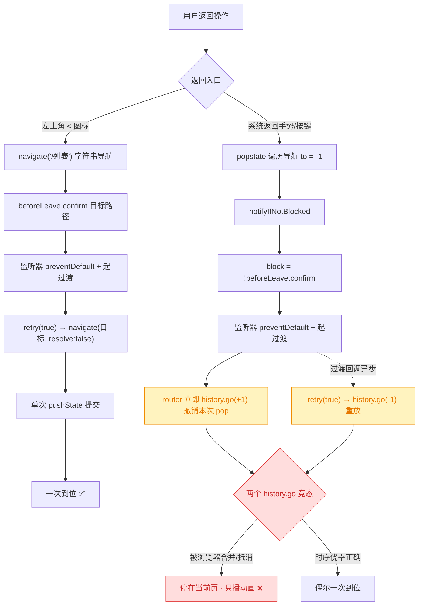
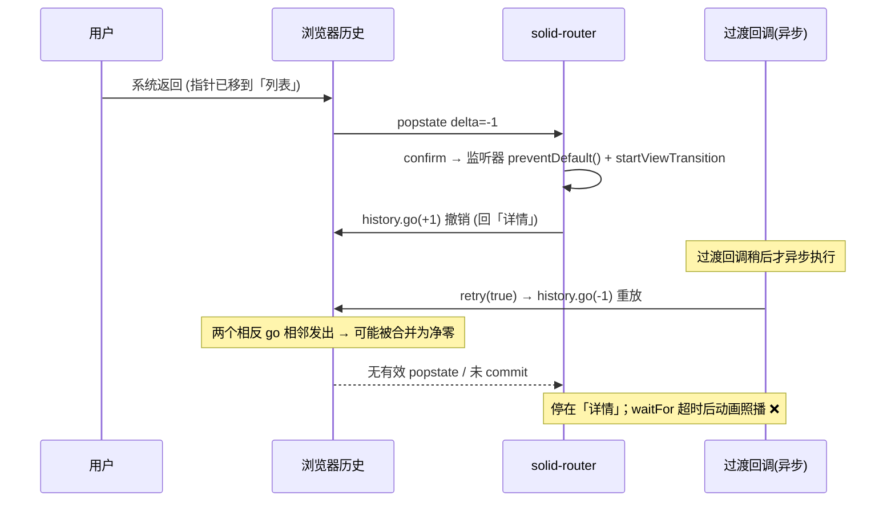
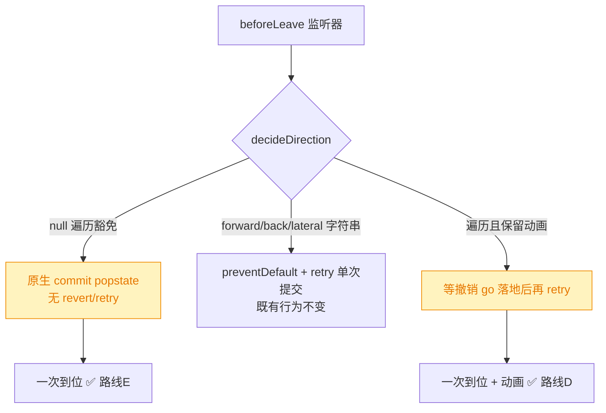
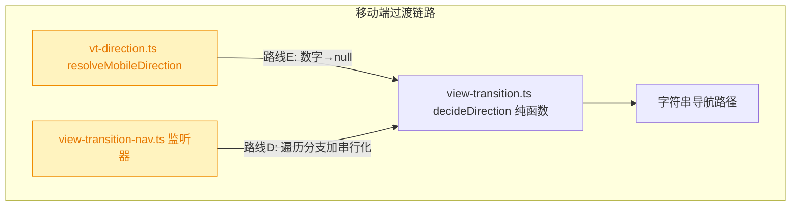

# gui-mobile 移动端系统返回需按两次才能回到列表页

## 1. 背景

gui-mobile 移动端在详情页（会话详情 ChatDetail、spec 详情 SpecDetail、脚本管理 Scripts）触发**系统返回事件**（Android 返回键 / 手势、iOS 边缘手势、浏览器后退）时，**可能需要按两次**才能回到列表页：第一次会出现 transition view 过渡动画，但动画结束后**仍停留在当前页**；第二次才真正返回。

而点击左上角导航区的 `<`（ChevronLeft）图标，**点击一次即可**回到列表页。

## 2. 需求

- 修复系统返回在详情页需要按两次的问题：系统返回**一次**即回到对应列表页。
- 消除「第一次只播动画、页面不变」的错觉。
- 不回归左上角 `<` 图标一次返回的既有正确行为，不影响页面间前进/平级切换的过渡动画。

## 3. 现状分析

### 3.1 两类返回走了两条不同的 router 路径

移动端所有页面切换都被 `AppShell` 里的 `createViewTransitionNav`（拦在 `useBeforeLeave`）统一套上 View Transition。关键在于**它对两类返回的处理路径不同**：

- **点 `<` 图标**：各详情页 `onBack` 是**显式字符串导航** `navigate('/')` / `navigate('/specs')` / `navigate('/ext')`（push）。走 solid-router 的 `navigateFromRoute → beforeLeave.confirm(目标路径)`，**不经过 popstate 的 revert 分支**。
- **系统返回**：浏览器/系统触发 `popstate`，走 solid-router 的 `notifyIfNotBlocked → beforeLeave.confirm(delta)`（`e.to` 是数字 `-1`），**命中 revert 分支**。

### 3.2 根因：popstate 的 revert + retry 造成双重 history.go 竞态

solid-router 对 popstate 的 `beforeLeave` 处理是「**先撤销、再由 retry 重放**」：监听器 `preventDefault()` 后，router 立刻 `history.go(-delta)` 把浏览器历史指针**撤回**当前页；而我们的过渡回调随后 `retry(true)` 又发一次 `history.go(delta)` 去**重放**这次返回。于是同一次系统返回会先后发出两个方向相反的 `history.go`。

问题在于：过渡回调（`document.startViewTransition` 的 update 回调）是**异步**执行的，它发出的重放 `history.go(-1)` 与 router 同步发出的撤销 `history.go(+1)` 时序不确定。当浏览器把两个相邻、方向相反的历史遍历**合并/抵消**为净零时：撤销没落地、重放也被吞掉，router 从未 commit，DOM 停在详情页；而 `waitFor(pathname 变化)` 600ms 超时后动画照播——于是「动画播了、页面没变」。第二次返回时历史指针状态已重新稳定，才生效。这正是「**可能**需两次」（时序相关、间歇复现）且**移动端更常见**（系统手势是主要返回方式、移动端任务调度更易触发失败时序）的原因。

精确层：涉及的源码与关键行

- `src/gui-mobile/src/AppShell.tsx:24` —— `createViewTransitionNav({ resolveDirection: resolveMobileDirection })`。
- `src/gui-shared/lib/view-transition-nav.ts:40-68` —— `useBeforeLeave` 监听器；`isTraversal = typeof e.to === 'number'`；`e.preventDefault()` 后在 `runViewTransition` 回调里 `e.retry(true)`，随后 `await waitFor(() => location.pathname !== from)`（600ms 超时兜底）。
- `src/gui-mobile/src/lib/vt-direction.ts:22-26` —— `resolveMobileDirection`：`to` 为数字时返回 `to < 0 ? 'back' : 'forward'`（`to === 0` 返回 `null`），即**系统返回始终触发过渡**。
- `src/gui-shared/lib/view-transition.ts:96-118` —— `waitFor(pred, timeoutMs = 600)`，基于 Solid effect + `setTimeout` 兜底。
- solid-router 0.16.1 `dist/index.js`：
  - `createBeforeLeave.confirm`（第 12-32 行）：`retry: force => { force && (ignore = true); l.navigate(to, {..., resolve:false}) }`。
  - `notifyIfNotBlocked`（第 60-77 行）：`if (delta && block(delta)) { ignore = true; window.history.go(-delta); } else notify()` —— **仅 popstate 路径有此 revert**。
  - `navigateFromRoute`（第 692-698 行）：`to` 为数字时 `utils.go(to)` → `window.history.go(to)`。
  - popstate 绑定（第 1538 行）：`bindEvent(window, "popstate", notifyIfNotBlocked(notify, delta => !beforeLeave.confirm(delta)))`。
- 对照：字符串导航 `navigate('/列表')` 经 `navigateFromRoute → beforeLeave.confirm(路径)`，prevented 后仅靠 `retry` 单次 `pushState` 提交，**没有 revert 的第二个 history 操作**，故 `<` 图标一次到位。

### 3.3 受影响页面与入口

- 受影响：所有二级/三级详情页的**系统返回**——`ChatDetail`(`/sessions/:id`)、`SpecDetail`(`/specs/:id`)、`Scripts`(`/ext/scripts`)，以及同机制的 `SpecDebug` / `SpecGit` / `RunOutput` / 两个 settings 页。
- 不受影响：左上角 `<` 图标（字符串导航）、四个一级 tab 之间的平级切换、下钻的 forward 动画。

## 4. 技术实现方案

修复只落在**遍历导航（`e.to` 为数字，即系统返回/前进）**这一支，字符串导航与前进/平级动画完全不动。核心是**消除同一次遍历里两个相反 `history.go` 的竞态**。存在两条可行路线，差异只在「系统返回是否保留滑动动画」这一 UX 取舍上：

- **路线 E（跳过遍历过渡）**：`resolveMobileDirection` 对数字 `to` 直接返回 `null`。`decideDirection` 得到 `null` → 监听器**不 preventDefault**、不起过渡 → solid-router 原生 commit 这次 popstate（`notify()`，无 revert、无 retry、无双 `history.go`）。系统返回一次到位、无过渡动画；`<` 图标动画不受影响。
  - 改动面最小、无时序依赖、行为确定；代价：系统手势返回没有 CSS 滑动过渡（iOS PWA 边缘手势本身有 OS 动画，反而更自然；Android 手势/返回键则变为瞬切）。
- **路线 D（保留动画，串行化两个 go）**：仍 preventDefault + 起过渡，但在遍历分支里**等 router 的撤销 `history.go(+1)` 真正落地（收到那一个 popstate）后再 `retry(true)`**，使两次遍历不再相邻合并。保留系统返回的滑动动画；代价：时序代码更复杂、依赖 popstate 观测与超时兜底，且需真机验证浏览器合并行为确实被规避。

### 4.1 影响范围（改造后）

改动集中在方向解析（路线 E）或遍历分支时序（路线 D），字符串导航路径零改动。

- 路线 E 触碰：`src/gui-mobile/src/lib/vt-direction.ts`（可选同口径处理桌面 `src/gui/src/lib/vt-direction.ts`）。
- 路线 D 触碰：`src/gui-shared/lib/view-transition-nav.ts`（共享，桌面同受影响，需一并回归）。
- 两条路线都不改后端、不改路由表、不改各页 `onBack`。

### 4.2 决策说明

> 决策记录：修复只作用于遍历导航（`e.to` 为数字），不动字符串导航与前进/平级动画 —— 依据现状分析 3.2，竞态仅由 popstate 的 revert 分支引入，字符串导航无 revert、本就一次到位，收窄改动面可避免回归。

> 决策记录：不修改各页 `onBack` 与后端 —— `onBack` 走字符串导航、行为正确；本问题纯前端过渡时序，沿用既有「后端零改动」边界。

> 决策记录：路线 E 与路线 D 的取舍留作待确认项（见第 5 节）—— 二者都能修复功能缺陷，唯一差异是「系统返回是否保留 CSS 滑动动画」，属依赖用户 UX 取向的主观决策，且路线 D 的浏览器历史合并规避效果需真机验证，无法仅凭读码确定，故上抛。

> 决策记录：系统返回的修复路线（是否保留过渡动画）—— 用户抉择「路线 D：保留系统返回滑动动画，改造遍历分支时序（等撤销 go 落地后再重放）」，理由：保留移动端系统返回的滑动过渡体验。故按路线 D 实施，改动落在共享的 `view-transition-nav.ts` 遍历分支，桌面端同受影响需一并回归。

### 4.3 路线 D 落地细节

改动只在 `src/gui-shared/lib/view-transition-nav.ts` 的**遍历分支**（`e.to` 为数字）。串行化两个相反 `history.go` 的关键时序：

1. 监听器仍 `preventDefault()` + 起过渡。**在起过渡之前**同步调用新增的 `waitForNextPopstate()` 注册一次性 `popstate` 等待——此刻 router 撤销用的 `history.go(-delta)` 尚未发出，故一定能接住那次撤销 popstate。
2. 过渡回调里先 `await revertLanded`（等撤销 go 落地），**再** `e.retry(true)` 重放。两个方向相反的遍历不再相邻挂起，浏览器无从合并成净零。
3. `waitForNextPopstate(timeoutMs = 600)` 带超时兜底：异常情况下等不到 popstate 也照常放行，退化为原行为，绝不把过渡永久挂起。
4. 字符串导航（`isTraversal=false`）不注册等待、路径零改动，`<` 图标一次到位与前进/平级动画完全不变。

> solid-router 0.16.1 时序佐证：`notifyIfNotBlocked`（dist/index.js:60-77）在 `block(delta)` 为真时**同步**执行 `window.history.go(-delta)` 撤销；撤销 popstate 因内部 `ignore` 标志被静默消费（不 notify、不改 location），但仍会派发 `popstate` 事件——正是本方案等待的信号。`retry(true)`（第 23-29 行）经 `navigate(-1, {resolve:false})` → `utils.go` 发出重放 `history.go`。

## 5. 待确认项

_暂无_

## 6. 任务清单

- [x] 在 `src/gui-shared/lib/view-transition-nav.ts` 遍历分支串行化两个 history.go：起过渡前同步注册 `waitForNextPopstate()`，过渡回调里 `await revertLanded` 后再 `e.retry(true)`（验收：遍历分支先等撤销 popstate 再重放；字符串导航路径不变）
- [x] 在 `src/gui-shared/lib/view-transition-nav.ts` 新增带 600ms 超时兜底的 `waitForNextPopstate()` 辅助函数（验收：注册一次性 popstate 监听、超时/落地任一即 resolve 并清理监听）
- [x] 运行 `pnpm run typecheck` 与 `pnpm run test`（验收：typecheck 通过、既有 vt-direction 用例全绿，遍历方向仍返回 back/forward 未回归）
- [ ] [manual] 真机验证：移动端详情页（ChatDetail/SpecDetail/Scripts）系统返回**一次**回到列表且保留滑动动画；桌面端浏览器后退不回归（验收：人工在真机/浏览器确认一次到位且历史合并竞态已消除）

## 7. 执行记录

- [x] 遍历分支串行化：在 `view-transition-nav.ts` 监听器 `preventDefault()` 后、起过渡**前**同步 `waitForNextPopstate()` 拿到 `revertLanded`；过渡回调改为先 `await revertLanded` 再 `e.retry(true)`。字符串导航 `isTraversal=false` 时 `revertLanded=undefined`，路径零改动。
- [x] 新增 `waitForNextPopstate(timeoutMs = 600)`：一次性 `popstate` 监听 + `setTimeout` 兜底，任一触发即 resolve 并 `removeEventListener` 清理，避免异常时把过渡永久挂起。
- [x] 验证：`pnpm run typecheck` 通过（tsc -b 无错）；`pnpm run test` 95 文件 969 通过 / 2 跳过，`vt-direction` 遍历用例（数字 `to` → back/forward）保持全绿，未回归。
- [ ] 遗留 [manual]：浏览器历史合并规避效果依赖真机验证（见任务清单第 4 项），Agent 环境无法驱动真机系统手势，留待人工确认。
- [x] 收尾：非 manual 任务全部完成、待确认项为 `_暂无_`、无 `！！！` 批注/`[open]` 条目，`stage` 置 `done`（仅剩 1 项 `[manual]` 真机验证按规则忽略，不阻断收尾）。
