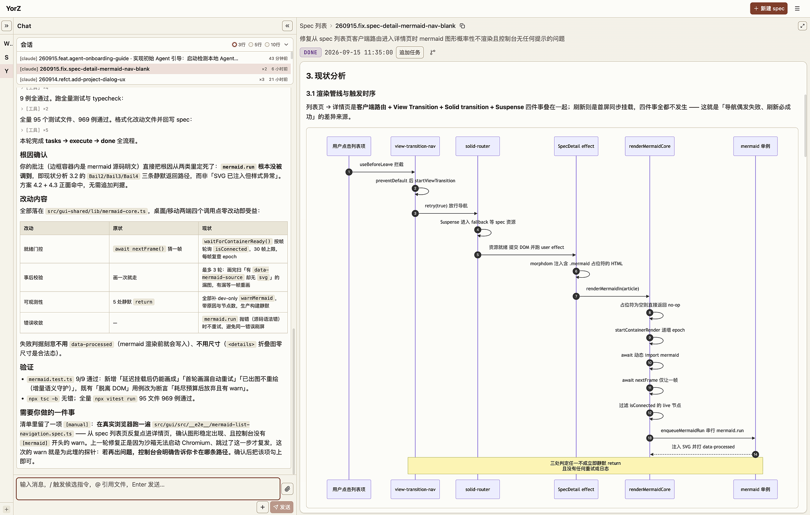

<div align="center">

# YorZ · 跨进 AI Coding 新时代

### Coding，如此简单、舒适

_极简、零门槛交互设计，移动端最佳实践，甚至能躺着“写”代码_

### 释放 Agent 潜力

_让 Claude / Codex 同时执行 10 个任务，互不干扰_

### 一图胜千言

_看图做决策，让开发者从文档、代码中解放出来_

---

[English](./README.md) · **中文** · [📖 使用指南](./docs/User-Guide-CN.md)

</div>



https://github.com/user-attachments/assets/d82f6a5c-07e9-403c-b2b5-4b60e3c5db94

## YorZ (柚子) 特性

- 极简交互设计，零门槛上手，编程新手友好
- 移动端最佳实践，甚至能躺着“写”代码
- 内置 Spec 驱动开发工作流，轻松搞定大型项目、复杂需求
- 并发执行任务，互不干扰，极致压榨 Agent
- 用丰富的技术图表对文档与代码信息进行升维，快速理解、高效决策
- 兼容主流 Agent，支持多 Agent 无缝切换

## 安装

需要 Node.js >= 22.19.0（该门槛来自随包引入的 Pi Agent SDK）。

```bash
pnpm add -g @yorz/cli

# or

npm install -g @yorz/cli
```

## 快速开始

### 启动服务

```bash
yorz serve
```

启动 YorZ Service，服务默认在后台运行。在浏览器打开 `http://localhost:7423` 即可访问仪表盘。

若需停止后台服务：

```bash
yorz serve stop
```

## 开发

```bash
# 安装依赖
pnpm install

# 构建 CLI + GUI
pnpm build

# 前台启动本地 CLI Service
pnpm dev:cli

# 在另一个终端启动 GUI dev server
pnpm dev:gui

# 运行测试
pnpm test
```
